@autoHeader:2
# Access The Site

To access the webpage and application, you will need to know the name your club uses on the InveTrak platform.

For example if you club name is demo, the URL will be :
[https://www.investrak.club/demo](https://www.investrak.club/demo).

Replace the last part of the URL (demo in tihs example) with the name of your investment club

## LOGGIN IN
When you get to the InvesTrak Application Platform for the first time, 
or if you have been idle on the site for a while, 
you will be redirected to the login page. 
The login page is the door between your web browser and the InvesTrak Platform. 
By logging in you confirm your identity to the system, so that the content is provided to you securely.

Enter your credentials and log in as shown below.

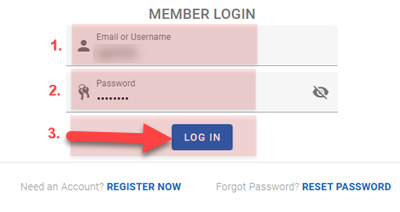

1. Enter your email address or your username
1. Enter your password
1. Click on the **`LOGIN IN`** button

## MANAGING YOUR CREDENTIALS
If you loose you password and you would like to reset it or you just want to change an old password, you can use the steps outlined below.

###	Resetting lost password

If you are unable to login or you forgot password, you can reset password as show below. 
Watch the video below to walk through the steps to reset your lost password.

<video src="static/video/Reset_lost_password.mp4" width="90%" controls>
  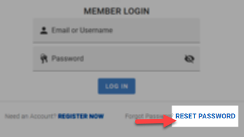
</video>

<!-- tabs:start >

#### **Click to Reset **
Click on the `RESET PASSWORD` button at the bottom of the login screen

 

#### **Request Reset **

Request a password reset as follows:

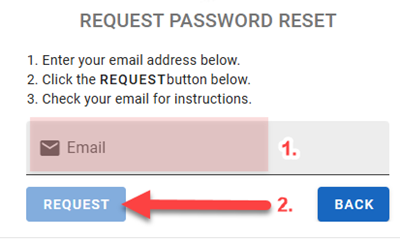 

  1.	Provide your email address.  
  1.	Click on the `Request reset password` button

#### ** Reset Confirmation **
  A confirmation page displays acknowledging recipt of the request.

  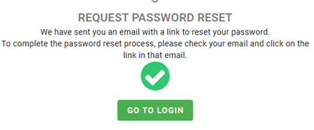 

#### ** Reset Email **
  You’ll receive an email with a link to reset your password.
  
  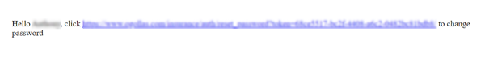 
  
#### ** Reset Password **
Click on the email link to be directed to the page to reset your password.

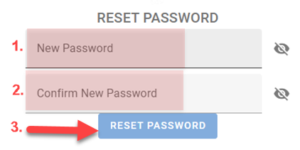 

1. Enter your new password
1. Enter your password again to confirm
1. Click on the `RESET PASSWORD` button

<!-- tabs:end -->

###	Changing current password

If you know your password and want to change it proceed as follows. Watch the video below to walk through the steps to change your password.

<video src="static/video/Change_current_password.mp4" width="90%" controls>
  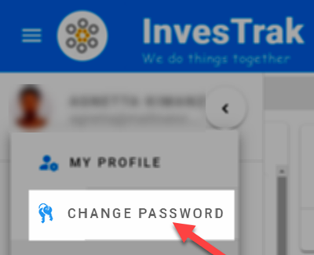
</video>

<!-- tabs:start >
#### **Click to Change **
Select `Change Password` option from the user profile drop down list.

 

#### **Change Password **

Change your password as follows:

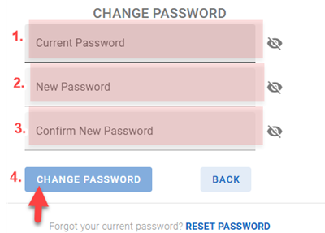 

1. Enter your old password.  
1. Enter your new password
1. Enter your password again to confirm
1. Click on the `Change Password` button
  
< tabs:end -->

## REGISTER A NEW ACCOUNT

!> **IMPORTANT**\
Check with your [**`CLUB ADMINISTRATOR`**](10_admin_member-accounts?id=_1031-admin-group) first before registering your account. Make sure that an account has not already been created for you.

If this is your first time in the club and your 
[**`CLUB ADMINISTRATOR`**](10_admin_member-accounts?id=_1031-admin-group) has not already created an account for you, you can use the Registration page to do so for yourself.

1. Click on the **`REGISTER NOW`** at the bottom of your club's login page
2. Fill in the details as shown in the video below
3. Once completed you will receive an email with the next steps to confirm your registration
4. Your registration application will be sent to the Investment club's [`Administrator`](10_admin_member-accounts?id=_1031-admin-group) to review and confirm.
   
<video src="static/video/Register_New_Account.mp4" width="90%" controls>
  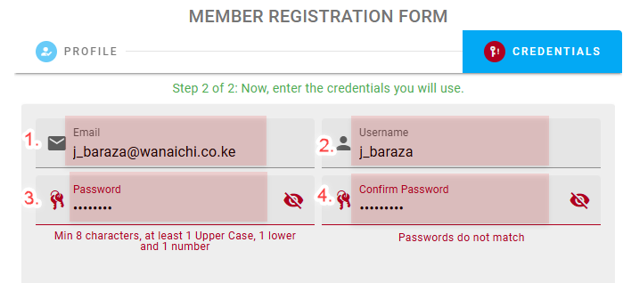
</video>

<!-- tabs:start >
#### **Click to Register **
Select `Change Password` option from the user profile drop down list.

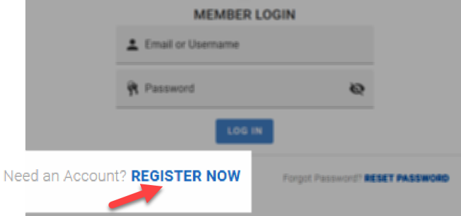 

#### **Provide Personal details **

Enter your personal details such as your name, phone number and residential address:

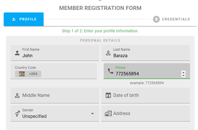 

#### **Provide Credentials **

Enter the credentials you will use to authenticate to the system:

 

1. Enter your email address.  
2. Enter your username you would like to use for login.
3. Enter your password (pay attention to the minimum security requirements)
4. Enter your password again to confirm (must match your password)

#### **Complete Registration **

Click on the `REGISTER` Button, confirm your information and then click on the second register button to complete your registration:

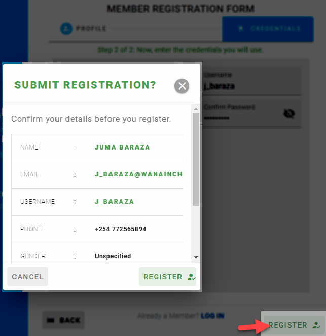 

<!-- tabs:end -->

