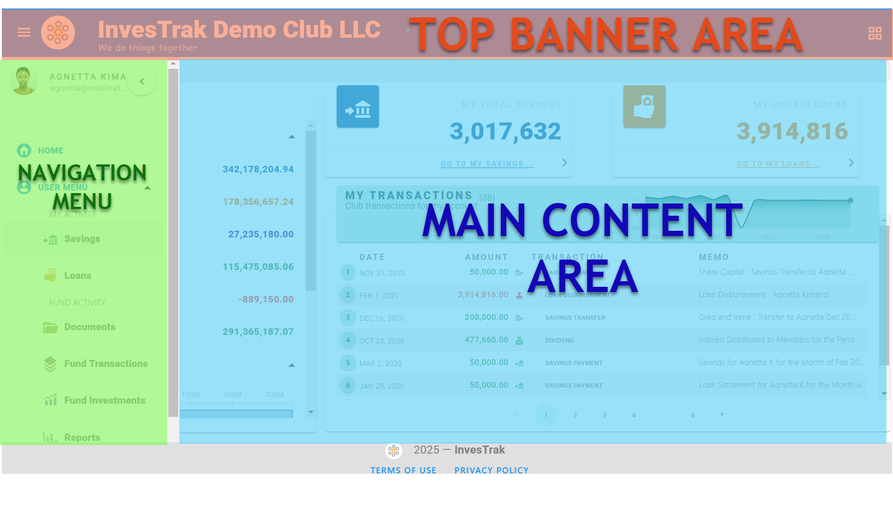
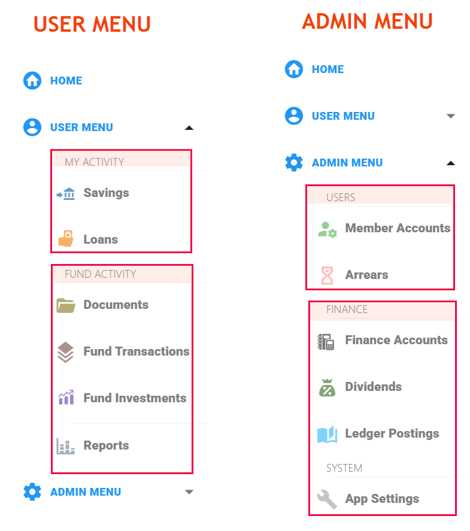

@autoHeader:3
# Navigating the Application
The Application design allows easy access of all the pages and content using the **`TOP BANNER AREA`**, the **`NAVIGATION MENU`**,  and the  **`MAIN CONTENT PAGE`**. After a successful log in, these sections will be displayed as shown below.

.

## THE TOP BANNER AREA 
The **`TOP BANNER AREA`** on the screen is visible from every page within the application. The application has a consistent look and feel as well as a uniform
set of links and icons for navigation, regardless of what page the member is currently on.

.

 It will display some additional icons and information as follows:
 
 - The **`NAVIGATION MENU BUTTON`** is displayed on the left side of the Top banner. Clicking it will hide or unhide the navigation menu.

 - The **`CLUB LOGO`** is displayed on the left side of the Top banner. Clicking it will navigate the member to the home page.

- The **`CLUB NAME`** is displayed on the next to the Club Logo. It displays the name of the club.
 
- The **`ADMIN QUICKMENU`** is only available to the admins of the Club. It provides shortcut menus to pages that are used for administrative tasks.

 
## THE NAVIGATION MENU
The navigation menu facilitates intuitive and seamless navigation between different pages within the application. The menu structure aims to make it easy for users to understand where to find information based on logical groupings and clear labels. 

The menus group links with similar content - like user related resources (**`Savings`** and **`Loans`**) vs club related resources (like **`Documents`**, **`Fund Transactions`** and **`Fund Investments`**). The groups of menus can be expanded to show the menu links under them or collapsed to reduce clutter.

.

### Member Drop Down
The **`Member Drop-down`** menu is a convenient navigation feature that provides members with quick access to essential account-related options. This menu is located near the top-left corner of the interface and is accessible by clicking on the the member's profile picture (or a generic avatar if there is no member profile picture).

  .

Menu options are:
- **`MY PROFILE`** - This option allows members to view and manage their personal profile information. Upon selection, members are redirected to a dedicated profile page

- **`CHANGE PASSWORD`** - This option provides members with the ability to update their account password. Clicking this option navigates to the **`CHANGE PASSWORD`** page.

- **`SIGN OUT`** - This option allows members to securely log out of the site. Selecting it terminates the active session and redirects the user to the login page.
Logging out is especially important when accessing the platform from shared or public devices to prevent unauthorized access to the account.

### My Profile page
**`MY PROFILE`** page allows an individual club member to view and edit personal details as well as other optional detail that the member's respective club might keep track of. 

<video src="static/video/My_Profile.mp4" width="400px" controls>
  
</video>

Below are the dirrent sections with the details required for each. 

<!-- tabs:start -->

#### **PERSONAL DETAILS**

[Personal Details](static/markdown/personal_details_fields.md ':include')

#### **EMPLOYMENT**

[Employment Details](static/markdown/employment_details.md ':include')

[Employment Details](static/markdown/employment_details_fields.md ':include')

#### **NEXT OF KIN**

[Next of Kin](static/markdown/next_of_kin.md ':include')

[Next of Kin](static/markdown/next_of_kin_fields.md ':include')

#### **RECOMMENDERS**

[Recommenders](static/markdown/recommenders.md ':include')

<!-- tabs:end -->

  
## THE MAIN CONTENT AREA 

The main content area is a dynamic page area that is used to display the data that you have selected using the navigation menus or links from the top banner. This is the page that will show you the important content on the site.

### Home page 

This is the page where the member will usually land when they log-in to the portal. The home page consists of several widgets that provide a summarized overview for the currently logged in member.

.

#### FUND SUMMARY

The Fund summary widget displays a summary of fund's overal status - including Cash Position, Outstadning loans etc.

 
 
#### MY TOTAL SAVINGS

The **`MY TOTAL SAVINGS`** widget displays a summary of all the savings contributions that the currently logged in member has made.

 

#### MY UNPAID LOANS
The **`MY UNPAID LOANS`** widget displays a summary of outstanding loans that the member owes.

 

#### MY TRANSACTIONS

The **`MY TRANSACTIONS`** widget displays the savings and loans transactions associated with the currenttly logged in member.

.

These include all savings contributions, savings trnasfers, savings withdrawals, loans disbursed, loan related charges, loan payments. The transactions are displayed both in graphical and tabular format.