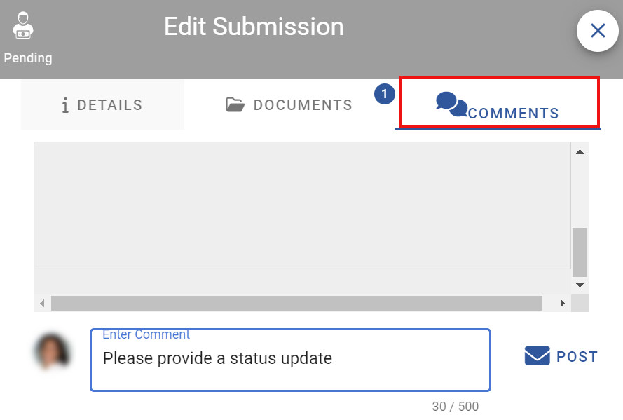

@autoHeader:4
# SAVINGS MODULE
The **`SAVINGS MODULE`** is used to display and track the details of member's savings contributions. 

[Savings Desc](static/markdown/savings_desc.md ':include')

## ACCESSING SAVINGS

To access the **`SAVINGS MODULE`**, click on the navigation menu as follows:

`User Menu` &#8702;`My Activity` &#8702; `Savings`.

<video src="static/video/Access_My_Savings.mp4" width="400px" controls>
  
</video>

The **`SAVINGS MODULE`** page is roughly divided into 3 sections:

 

1. **TRANSACTIONS LIST** - displays the list of individual transactions (savings desposit, withdrawal and transfers).
2. **SAVINGS SUMMARY** - displays a summary of the savings for the individual account including total savings, arrears, account share (percentage of total contributed savings).
3. **CHARTS** - display charts on the trends of the savings transactions.

## SEARCH SAVINGS TRANSACTIONS

Use the search bar `Search Transactions` to find a particular transactions. Type a either a name or a date or part of the memo in the search field to find what you are looking for.

<video src="static/video/Search_Savings.mp4" width="400px" controls>
  
</video>

## ARREARS

<!-- embed:start:participation dates warning -->

[Participation Dates Warning](static/markdown/participation_dates_warning.md ':include')

<!-- embed:end:participation dates warning -->

<!-- embed:start:expected contribution warning -->

[Expected Contribution Warning](static/markdown/expected_contribution_warning.md ':include')

<!-- embed:end:expected contribution warning -->

<!-- embed:start:arrears -->

[Arrears Tab](static/markdown/arrears.md ':include')

<!-- embed:end:arrears -->

### My Arrears Dialog

My arrears dialog can be accessed by clicking on the arrears link from the [`Savings`](04_user_savings) page. 

.

The Arrears dialog is displayed with two tabs.

#### Allocations Tab
<!-- embed:start:arrears tab -->

[Allocations Tab](static/markdown/arrears_tab.md ':include')

<!-- embed:end:arrears tab -->

#### Transactions Tab

<!-- embed:start:allocations tab -->

[Transaction Tab](static/markdown/arrears_allocations_tab.md ':include')

<!-- embed:end:allocations tab -->

## SELF SUBMIT SAVINGS

>**NOTE.** \
>For the `SELF SUBMITTED SAVINGS` tab to be visible, the system must have the [`SELF SUBMIT LOAN PAYMENTS`](17_admin_system-settings?id=self-submit-loan-payments) setting turned on.

<!-- embed:start:app settings -->

[Savings Self Submit](static/markdown/self_submit_savings.md ':include')

<!-- embed:end:app settings -->

### Submit a Savings Payment

Follow these steps to make a submission:

1. From the savings page navigate to the **`SELF SUBMITTED SAVINGS`** tab and click on the 3 vertical dots menu.

&nbsp;&nbsp;&nbsp;&nbsp; 

1. From the expanded menu options select **`+Pay`** to open the Self submit dialog screen.

&nbsp;&nbsp;&nbsp;&nbsp; 

3. A `New Payment` dialog opens up. Enter the amount that has been self submitted by the member to the bank. Most of the fields are pre-filled and you can edit them if you like.

&nbsp;&nbsp;&nbsp;&nbsp;&nbsp;.

1. Next, click on the `DOCUMENTS` Tab and upload an image of the bank slip or receipt that shows the bank transaction. This is important to allow the Treasurer to review and reconcile the recorded self submitted payment with the bank statements so that it can be approved.

&nbsp;&nbsp;&nbsp;.

   
?>**ADDITIONAL INFO** \
More details on adding and working with documents can be found on the [**`DOCUMENTS`**](06_user_documents.md) module.  

1. Once the receipt image has been uploaded, click on th **`SUBMIT`** button. A dialog will be displayed to confirm that the self submitted record has been saved. The treasurer will be notified to reveiw and approve.

&nbsp;&nbsp;&nbsp;&nbsp;&nbsp;.

?>**ADDITIONAL INFO** \
If more clarification is required after the record has been submitted both the Treasurer and the member can use the `COMMENTS` Tab of the record to provided additional information.

.