@autoHeader:5
# Loans Module
The Loans module is used to display and manage the details of loans given to the club members. It manages the workflow for a loan application and approval and also tracks the payments and charges associated with the loan.

## ACCESSING LOANS

To access the loans module, click on the navigation menu as follows : `User Menu` &#8702;`My Activity` &#8702;  `Loans`.

<video src="static/video/Access_My_Loans.mp4" width="400px" controls>
  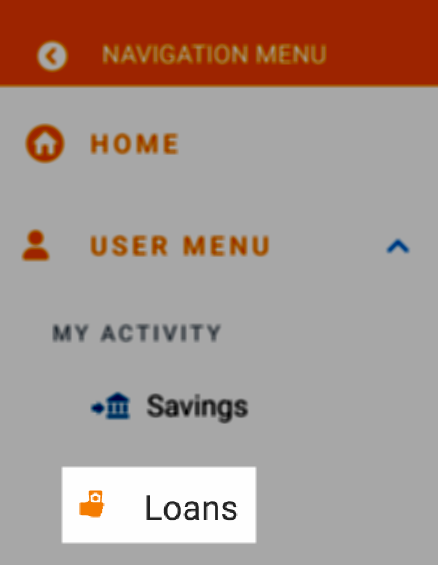
</video>

The landing page of the Loans module page displays the list of individual loan applications submitted by the club member. The page also has a search bar to search for  loans by free text and filter to list loans by status. 

<!-- 

    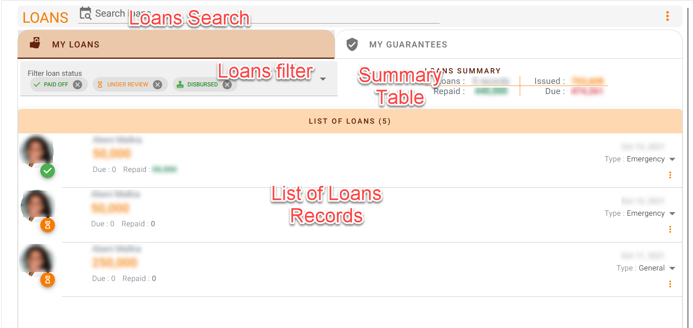

 -->
.

The landing page also displays various summaries for the loans taken by the club member.

## SEARCH LOAN RECORDS

Use the search bar `Search loans` to find a particular loan record. Type a either a name or a date or amount or part of the memo in the search field to find a specific loan

<video src="static/video/Search_Loans.mp4" width="400px" controls>
  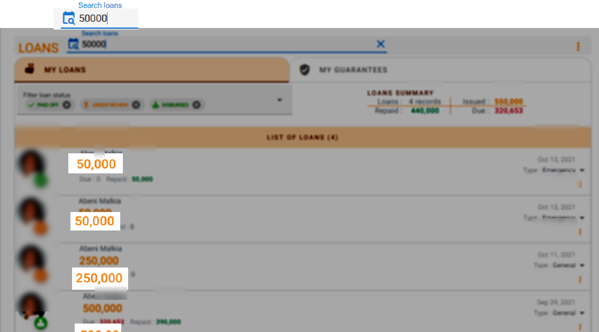
</video>

You can also filter the loans by status. Filtering is a useful way to display only the loan records that you want based on the current status of the loan.

<video src="static/video/Filter_My_Loans.mp4" width="400px" controls>
  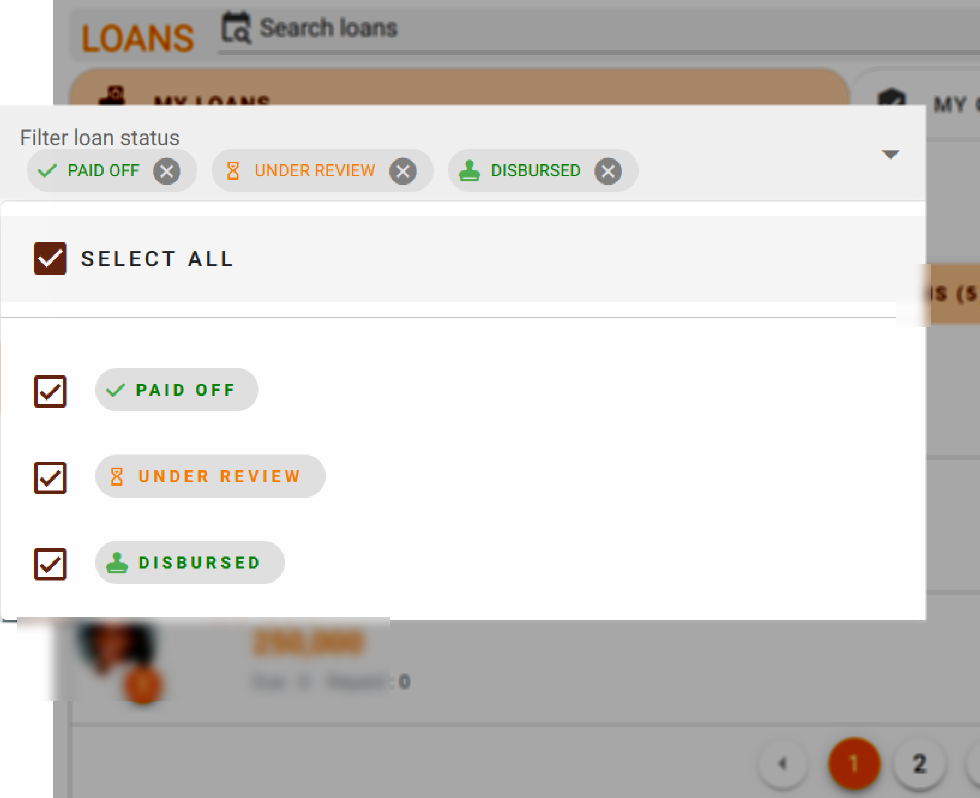
</video>

## APPLY FOR A LOAN
Click on the three vertical dot menu on the Loans page and select the `Apply` option.

The `Apply Loan` dialog page opens up. Use this dialog to apply for a new loan.

<video src="static/video/Apply_Loan.mp4" width="400px" controls>
  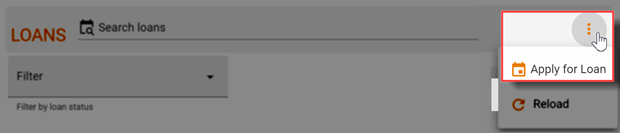
</video>

<!-- tabs:start >

#### **Loan start**
1. You can begin by clicking on your profile to ensure that all your profile details are correct
1. Check the box to accept the loan terms. You can optionally click on the policy link to review all the terms before you accept them
1. Click on the start button to proceed to the next step

#### **Loan Type**
If your club has different types of loans, select the one that is most suitable for you

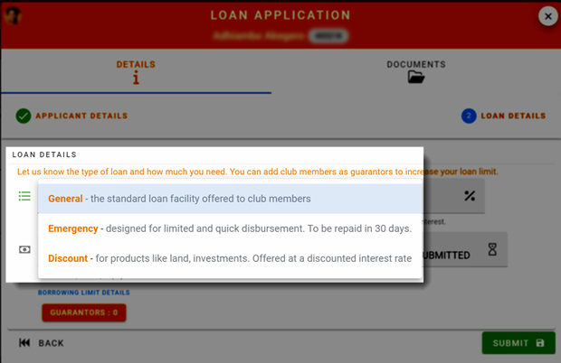.

#### **Loan Limit**
Click on the links to confirm what you can borrow

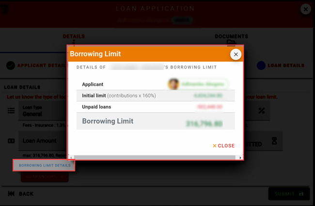.

#### **Loan Guarantor**
If you need to borrow more than your loan limit allows, you can add another member as your Guarantor.

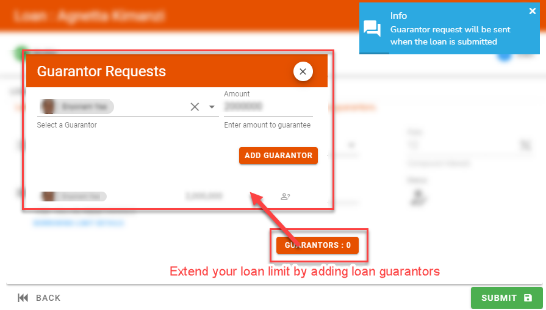.

#### **Loan submit**
After confirming the amount and the guarantors click on the submit button. You will receive a notification that your loan has been submitted.

    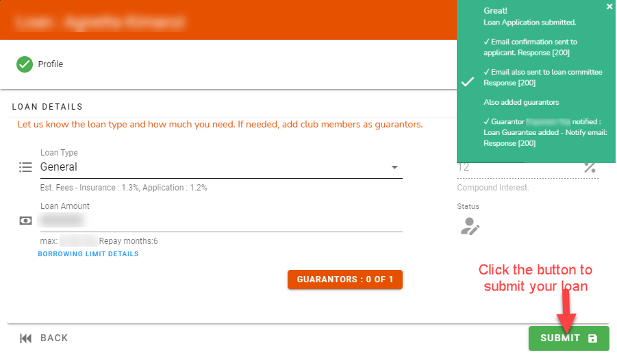

#### **Notification**
You will receive a notification that your loan has been submitted.

    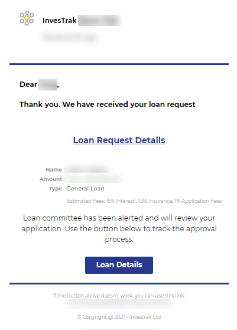

<!-- tabs:end -->

### Loan Guarantee
If you guaranteed any loans they will appear under `My Guarantee Requests` tab. Aditionally you will also have received an email with the details and link to open the guarantee record.

Click on the loan guarantee request to open up the dialog. Use the dialog to reveiw the details of the guarantee request. After confirming the guarantee amount, your loan borrowing limit accept or decline the request.

<video src="static/video/Loan_Guarantee_Process.mp4" width="400px" controls>
  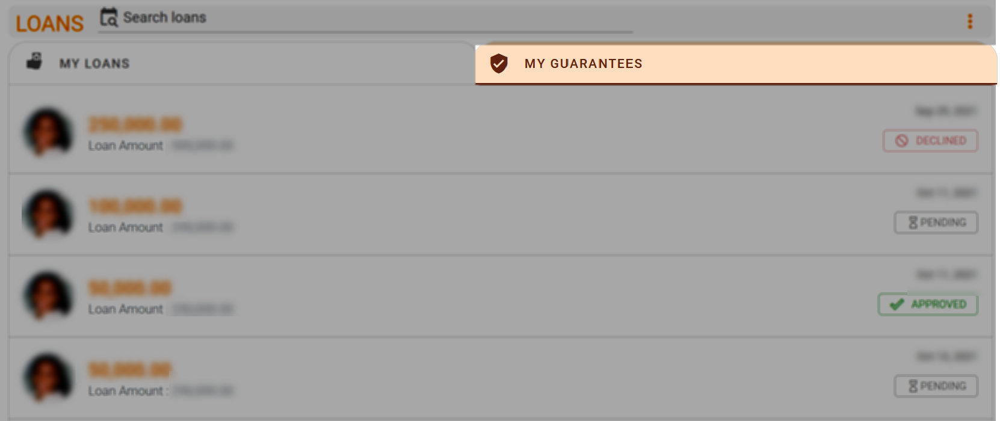
</video>

Once you approve or decline a notification will be sent to the loan applicant.

## SELF SUBMIT LOANS
<!-- embed:start:app settings -->

[Loan Self Submit](static/markdown/self_submit_loan.md ':include')

<!-- embed:end:app settings -->

### Self Submit a Loan Payment
Follow the steps outlined in the video below to submit a loan payment for approval.

<video src="static/video/Loan_Self_Submit_Payment.mp4" width="400px" controls>
  
</video>
