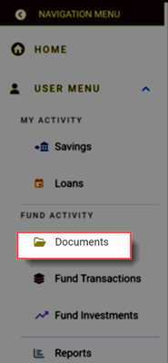
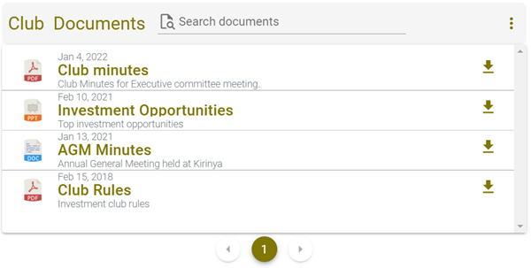
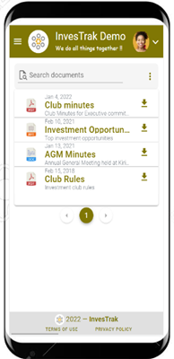
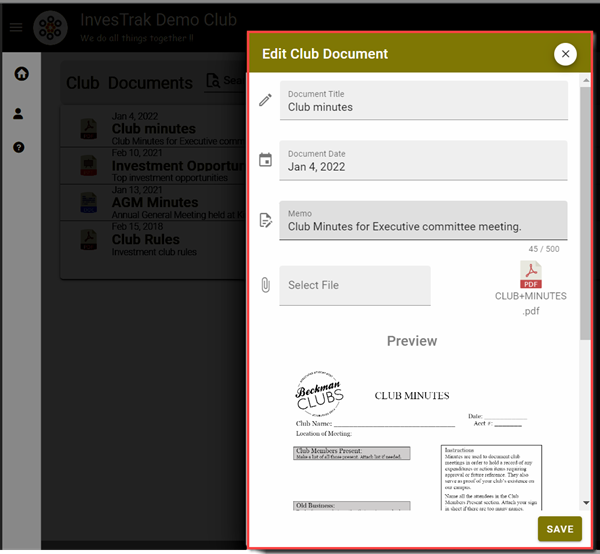
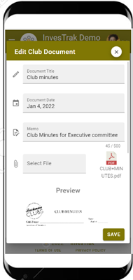
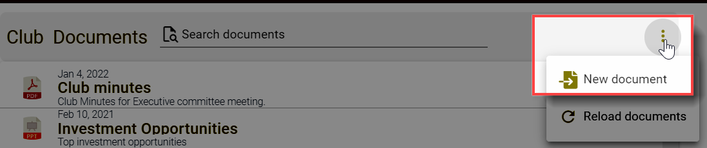
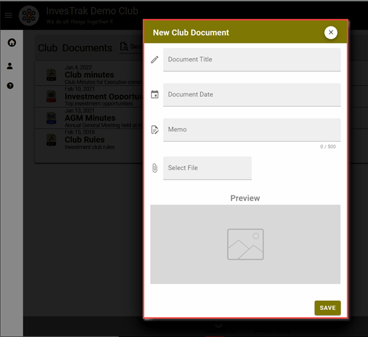
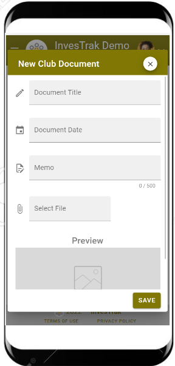

@autoHeader:6
# Documents Module

The Documents module displays a list the documents clubs relevant documents, such as meeting minutes and bank statements. 

The [`Company Secretary`](10_admin_member-accounts?id=_1033-secretary-group) or any [`Committee Member`](10_admin_member-accounts?id=_1032-committee-group) will be able to add and remove documents from this module. All members are able to view & download any company documents posted here.

## ACCESSING DOCUMENTS

To access the documents module, click on the navigation menu as follows: `User Menu` ->`Fund Activity` -> `Documents` Link from the navigation menu.

<video src="static/video/Access_Documents.mp4" 
    width="400px" controls autoplay loop>
  
</video>

## DOCUMENTS LANDING PAGE
The Documents Landing page displays a list of all the documents that have been uploaded.
<!-- tabs:start -->
#### **Desktop**

    

 #### **Mobile**
 

    

<!-- tabs:end -->

## WORKING WITH DOCUMENTS

### View or Edit a document
1. From the landing page in the `Documents Module` click on a document to open it.
1. The `Edit Club Document` page opens to display the document details.

<!-- tabs:start -->
#### **Desktop**

    

#### **Mobile**

    

<!-- tabs:end -->

Details of the document record include:

- `Document Title` – A descriptive title by which the document can be identified.
- `Document Date` – The date the Document was uploaded.
- `Memo` – Any additional information regarding the transaction.
- `File Upload` – If the user has permission this is the button to upload the document file.

### Upload a Document
1. From the landing page in the `Documents Module` Click on the three vertical dot menu and select the `New document` option.

    

1. The `New Club Document` page opens.
1. Fill in the details and clik Save to upload the document.

<!-- tabs:start -->
#### **Desktop**

    

#### **Mobile**

    

<!-- tabs:end -->

