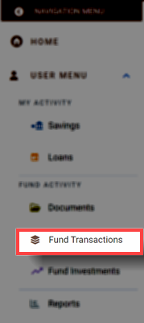
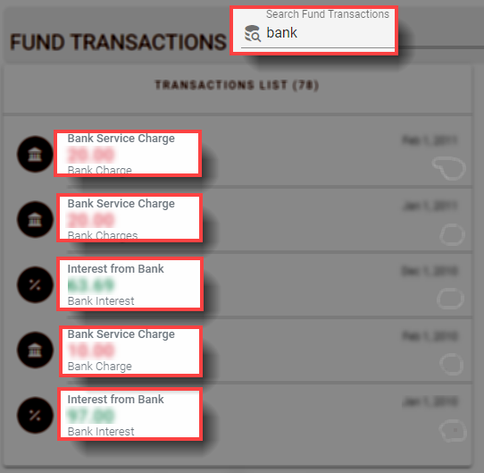
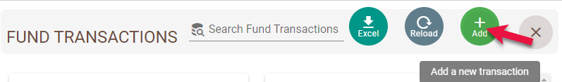
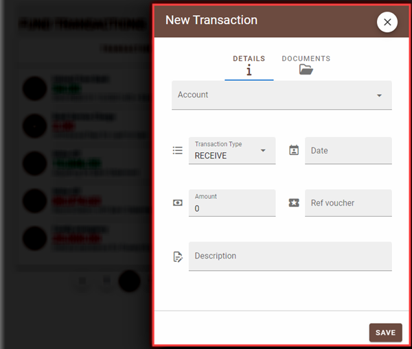

@autoHeader:7
# Fund Transactions
The Fund Transactions module is used to track the details of the Club's financial transactions. This covers any expenses incurred or revenue received by the club. 

## ACCESSING FUND TRANSACTION
To access the Fund Transactions module, click on the navigation menu as follows: `User Menu` &#8702;`Fund Activity` &#8702; `Fund Transactions`.

<video src="static/video/Access_Fund_Transactions.mp4" 
    width="400px" controls>
  
</video>

The landing page of the Fund Activity module displays all the club transactions – expenses, audit fees, bank charges etc. It also displays a chart summary of all the transactions by month to enable users observe trends.

## SEARCH FUND TRANSACTIONS 

Use the search bar `Search Fund Transactions` to find a particular transaction. Type a memo, date, amount, account title to find a specific record.

<video src="static/video/Search_Fund_Transactions.mp4" 
    width="400px" controls>
  
</video>

## ADD A NEW FUND TRANSACTION

If your account has the required permissions you can add a new fund transaction. Click on the three vertical dot menu on the `Fund Transactions` page and select the `New Transaction` option.

.

The `New Transaction` dialog page opens up. Use this page to enter a new transaction.

.
