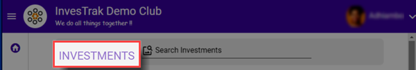
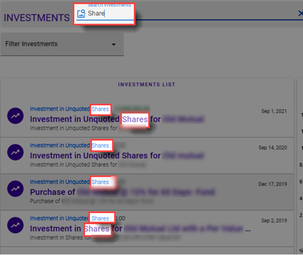

@autoHeader:8
# Investments Module

The Investments Module is used to display and manage the details of the Club's Financial Investments portfolio.

## ACCESSING INVESTMENTS

To access the Investments module, click on the navigation menu as follows :

 `User Menu` ->`Fund Activity` ->  `Fund Investments`.

<video src="static/video/Fund_Investments.mp4" 
    width="400px" controls autoplay loop>
  
</video>

The Investments module landing page will display a list of all investment records. It also displays a graph summary of the financial performance of the investment portfolio over time.

## SEARCHING INVESTMENT RECORDS

Use the search bar `Search Investments` to find a particular investment record. Type a either a title or a date or part of the account number in the search field to find what you are looking for.

<video src="static/video/Investments_Search_Filter.mp4" 
    width="400px" controls autoplay loop>
  
</video>

You can also filter the investment records by status (Active or Dormant). 

## ADD A NEW INVESTMENT RECORD

.

If your account has the required permissions you can add a new Investment Record. Click on the three vertical dot menu on the Investment Records page and select the `New Investment` option.

The `New Investment` dialog page opens up. Use this page to enter a new transaction.

.

## UNDERSTANDING INVESTMENT INDICATORS
The Investment Records display several indicators to help a club member understand the performance of the associated Investment.

.

### Investment FUNDING
 **`Investment FUNDING`** is the cumulative sum of money that has been used to fund the Investment. Any external money that is put into the Investment (e.g. Deposit from Bank), will increase the `Investment FUNDING` amount. Any money withdrawn from the Investment (e.g. Transfer to Bank), will decrease the `Investment FUNDING` amount.

### Investment GAINS
 **`Investment GAINS`** is the money that has been made or lost from the Investment. 
 Any income that is derived from the Investment (e.g. interest, dividends and 
 capital gains) will increase the `Investment RETURNS` amount. 
 Any loss (e.g. fees, taxes or capital loss) will decrease the `Investment RETURNS` 
 amount.

### Investment DEBITS
**`Investment DEBITS`** is the money that has been withdrawn from the Investment.

### Investment VALUE
**`Investment VALUE`** is the total value of the Investment at any given time. 
It is the combination of the `Investment FUNDING` (taking into account depositsand  
withdrawals) and `Investment GAINS` (taking into account gains, losses, taxes and fees).

## INVESTMENT TRANSACTIONS
Investment Transactions can be found in the `Edit Investment` page of each Investment record. They provide a way to granularly track the transactions for deposits, withdrwals, gains, losses, taxes and fees associated with the Investment.

.

 1. From the `Investments` landing page, click on an Investment record to view its details.
 1. The `Edit Investment` dialog page is displayed with the Investment's details.
 1. Click on the `Transactions` Tab to view the transactions.

## INVESTMENT DOCUMENTS
Each Investment record has the abilty to load associated documents (e.g. Statements, Tax receipts etc.). 

.

1. From the `Investments` landing page, click on an Investment record to view its details.
2. The `Edit Investment` dialog page is displayed with the Investment's details.
3. Click on the `Documents` Tab to view the transactions.

Details on adding and working with documents can be found on the [`Documents`](06_user_documents.md) page.