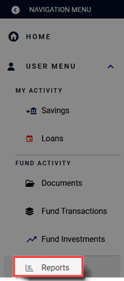

@autoHeader:9
#	Reports Module
The reports module provides an overview of the financial health of the investment club. 

## ACCESSING REPORTS
To access the reports module, click on the navigation menu as follows :
    `User Menu` ->`Fund Activity` ->  `Reports`

<video src="static/video/Accessing_Reports.mp4" 
    width="400px" controls autoplay loop>
  
</video>

The landing page of the reports module displays several sections :

.

## FILTER DATES
`Filter Dates` section allows you to filter the records between to dates. It includes a year dropdown to select all records for a specific calendar year and a calender input control to select any range between two give dates.

.

## FUND SUMMARY
`Fund Summary` section displays a summary of fund's overal status including Cash Position, Outstanding loans etc.

The Fund summary section displays a summary of fund's overal status - including Cash Position, Outstadning loans etc.

.

## FINANCIAL REPORTS

!>The financial reports are for informational use only. They are intended only to provide guidance and insight into the regular and daily activities of your investment club. Consult a certified accountant or authorised financial professional  before using them for regulatory reporting.

### Financial Reports - Balance sheet
The Balance Sheet details of the assets and liabilities of club. The Total Assets will always equal the Total Liabilities plus Members Equity of the club.

.

The assets include Cash (at hand and in the bank), tangible assets and property and value of security and investments.

The liabilities will include any debts owed and accounts payable.

The difference between the assets and liabilities will be the member equity. The members equity is divided into profits made during the year (retained earnings ) minus all dividends members investment.

### Financial Reports - Cashflow report
The Cashflow report summarizes the amount of cash and cash equivalents coming into(revenue) and getting out of (expenditure) the club. The revenue comes from contributions, loan payments, and other miscellaneous income like bank charges. The expenditure comes from investments, loan disbursements and other miscellaneous expense like bank charges.

.

### Financial Reports - Profit Loss Statement
The profit loss statement report summarizes the revenue, costs, and expenses incurred by the club. The income comes from contributions, loan interest, and other miscellaneous income like bank charges. The expenditure comes from expenses like bank charges, fees, taxes, services etc.

.