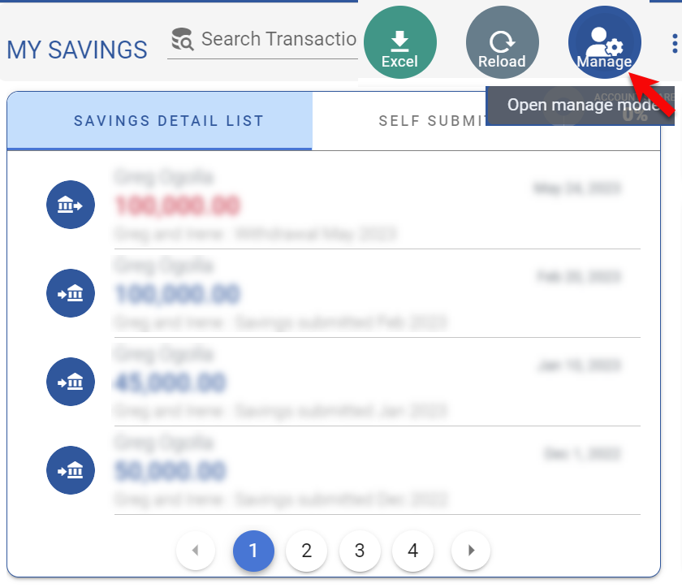
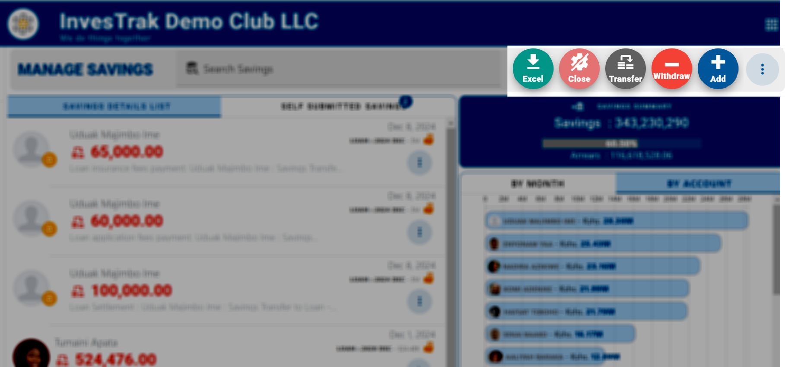
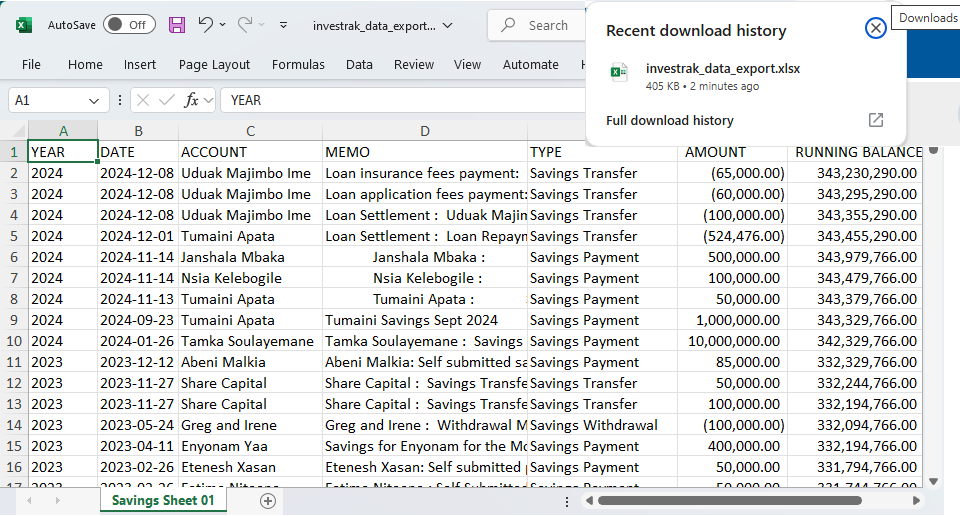

@autoHeader:12
# Manage Savings

[Savings Desc](static/markdown/savings_desc.md ':include')

 The **`MANAGE SAVINGS`** module is an extension of the [**`SAVINGS MODULE`**](04_user_savings). It provides the [`TREASURER`](10_admin_member-accounts?id=_1034-treasurer-group) with the  controls to administer members' savings contributions.

## ACCESSING MANAGE SAVINGS
><ins>**NOTE**</ins>\
>The **`MANAGE SAVINGS`** module can only be accessed by security group members with the [`finance_read_all`](10_admin_member-accounts?id=finance_read_all) permission. This would normally include the [`ADMIN`](10_admin_member-accounts?id=_1031-admin-group), [`TREASURER`](10_admin_member-accounts?id=_1034-treasurer-group) and [`COMMITTEE`](10_admin_member-accounts?id=_1032-committee-group) security groups.

You can access the manage savings module in one of two ways:

1. Click on the three vertical dot menu on the [**`SAVINGS`**](04_user_savings) module and select the **`MANAGE`** button.

&nbsp;&nbsp;&nbsp;&nbsp;.

2. Alternatively, you can access the module by clicking on the **`MANAGE SAVINGS`** button located in the Admin Quick menu in the [**`TOP BANNER AREA`**](03_navigate-the-app?id=_31-the-top-banner-area)

&nbsp;&nbsp;&nbsp;&nbsp;.

The **`MANAGE SAVINGS`** page is roughly divided into three sections:
1. **`TRANSACTIONS LIST`** - the list of member transactions. 
2. **`SAVINGS SUMMARY`** - a section on savings summary and totals. 
3. **`CHARTS`** - a section on the monthly chart of all contributions.

.

## EDIT TRANSACTIONS
There are several types of transactions to work with. 

### The Savings Dialog window
The Savings record is edited using the Savings dialog window. 
The details of the fields on the dialog are as follows:

 1. `Transaction Date` - A text field to capture the date when the transaction happened.
 2. `Amount` - The cash amount for the transaction.
 3. `Account` - A drop down field to select the member account associated with the savings transaction
 4. `Ref Voucher` - This is a text field that is used by some club to attach a reference voucher to a transaction.
 5. `Description` - A memo field that is used to capture any additional free text information about the transaction.
 6. `Arrears` - This line will only appear if the [**`TRACK ARREARS`**](17_admin_system-settings?id=system-will-track-arrears) setting is turned on. It indicates the amount that the member owes in arrears. Clicking on it will open the [**`ARREARS`**](11_admin_arrears.md) module.

Depending on the type of record being edited some of the fileds are visible or hidden.

&nbsp;&nbsp;&nbsp;&nbsp;.

### Manage Savings Menu Options

Depending on the Savings record to add/edit or the action to be performed the **`Manage Savings`** menu provides several options.

.

Click on the three vertical dot menu on the **`Manage Savings`** page and select one of the five options:
<!-- tabs:start -->

#### **New Payment**

- **`New Payment`** option is used to create a new savings transaction.
- The fields are exactly the same as described in the **`Savings Dialog Window`** section above.
- It is generally the most frequent way to enter and edit Savings contribution submitted by members.

.

#### **New Withdrawal**

- **`New Withdrawal`** option is used to create a new withdrawal transaction.
- The fields are exactly the same as described in the **`Savings Dialog Window`** section above.
- The difference with the options above is that the amount is <ins>deducted rather than added</ins> from the respective member's ledger account.
- The most typical use is when giving money back to a member (for example if exiting from the club)

.

#### **New Transfer**

- **`New Transfer`** option is used to create a new transfer between two members 
or between a member and another account (loan or share capital).
- The difference with the **`New Savings`** and **`New Transfer`** options 
is that there is a **FROM** field and a **TO** field. 
- The amount is <ins>deducted</ins> from the ledger account in the **FROM** field 
and <ins>added</ins> to the ledger account in the **TO** field.

?>**ADDITIONAL INFO**\
For the **TO** account, in addition to transfering funds to other Member Savings accounts you can also transfer to one of your loan accounts with an outstanding balance or to the **`SHARE CAPTIAL`** ledger Account.
  
.

#### **Close Manage Mode**
**`Close Manage Mode`** option to go back to the [**`SAVINGS`**](04_user_savings) module.

All the Savings management controls are close and only the currently logged in individual's savings record are displayed.
  
#### **Export to Excel**
The **`Export To Excel`** function exports the currently displayed Savings records to be downloaded as an Excel file.

.
<!-- tabs:end -->

## SAVINGS DOCUMENTS
Each Savings record has the abilty to load associated documents (e.g. Bank Deposit slip etc.). 

.

1. From the **`MANAGE SAVINGS`** landing page, click on an Savings record to view its details.
2. The **`Edit Payment`** dialog page is displayed with the Savings details.
3. Click on the **`DOCUMENTS`** Tab to view the attached documents.

?>**ADDITIONAL INFO** \
More details on adding and working with documents can be found on the [**`DOCUMENTS`**](06_user_documents.md) module.  

## MANAGE SELF SUBMITTED SAVINGS

>**NOTE.** \
>For the `SELF SUBMITTED SAVINGS` tab to be visible, the system must have the [`SELF SUBMIT SAVINGS`](17_admin_system-settings?id=self-submit-savings) setting turned on.

<!-- embed:start:app settings -->

[Savings Self Submit](static/markdown/self_submit_savings.md ':include')

<!-- embed:end:app settings -->
### Approve or Decline Self Submitted Savings
Follow these steps to approve or decline a submission:

1. From the Manage Savings page click on the **`SELF SUBMITTED SAVINGS`** tab and select the self submitted record you would like to approve or decline.
   
.

2. The `Self Submitted Payment` dialog opens up. On the **`DETAILS`** Tab, review the details of the payments  that has been self submitted by the member to the bank. Most of the fields are pre-filled and you can edit them if you like.
   
.

3. Next, click on the **`DOCUMENTS`** Tab and review the upload an image of the bank slip or receipt that shows the bank transaction. This provides the proof needed to review and reconcile the recorded self submitted payment with the bank statements so that it can be approved.
   
&nbsp;&nbsp;&nbsp;.

4. If everything looks ok, click on the Green `APPROVE` button. You can also reject submitted record by clicking on the `DECLINE` button.

.

>**NOTE.** \
>If more clarification is required after the record has been submitted both the Treasurer and the member can use the `COMMENTS` Tab of the record to provided additional information.

.