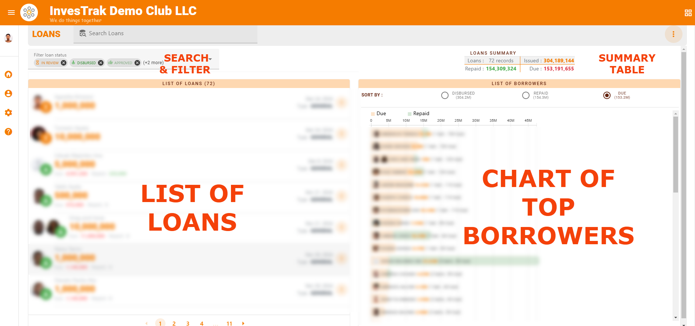

@autoHeader:13
# Manage Loans

[Loans Desc](static/markdown/loans_desc.md ':include')

The **`MANAGE LOANS`** module is an extension of the [**`LOANS`**](05_user_loans.md) module. It is used to perform additional functions like approving and disbursing loans.

## ACCESSING MANAGING LOANS
><ins>**NOTE**</ins>\
>The **`MANAGE LOANS`** module can only be accessed by security group members with the [`finance_read_all`](10_admin_member-accounts?id=finance_read_all) permission. This would normally include the [`ADMIN`](10_admin_member-accounts?id=_1031-admin-group), [`TREASURER`](10_admin_member-accounts?id=_1034-treasurer-group) and [`COMMITTEE`](10_admin_member-accounts?id=_1032-committee-group) security groups.

You can access the module  in one of two ways:

1. Click on the three vertical dot menu on the Loans page and select the `MANAGE MODE` option

  

2. Alternatively, you can access the module by clicking on the **`MANAGE LOANS`** button located in the Admin Quick menu in the [**`TOP BANNER AREA`**](03_navigate-the-app?id=_31-the-top-banner-area)

  

The **`MANAGE LOANS`** module page displays the list of individual loan record and a section showing a chart of top borrowers. There are also controls for searching and filtering the loan records as well as a summary table of all the loans.

  

## LOAN APPROVAL WORKFLOW
<!-- embed:start:Loan apply workflow -->

[Loan application workflow](static/markdown/loan_application_workflow.md ':include')

<!-- embed:end:Loan apply workflow -->

### Applying for a Loan
The Loan application can be made by any member of the Investment club. The procedure for applying is detail in the **`USER LOANS`** module under [**`Appy for a Loan`**](05_user_loans?id=_53-apply-for-a-loan)

### Approving Loan Requests
> <ins>**NOTE**</ins>\
To approve loan requests, you must be a member of the [`COMMITTEE`](10_admin_member-accounts?id=_1032-committee-group) security group.

> <ins>**NOTE**</ins>\
You <ins>CANNOT</ins> approve your <ins>OWN</ins> loan requests, even if you are a member of the [`COMMITTEE`](10_admin_member-accounts?id=_1032-committee-group) security group.

After a member has submitted a [`loan request`](05_user_loans?id=_53-apply-for-a-loan), an email notification will go out to all committee members. A certain number of committee members are required to approve the loan before it can be marked as approved.

The approval controls are found in the **`APPROVAL DETAILS`** section of the loan record. Follow the step outline in the video below to provide your approval decision.

<video src="static/video/Loan_Approval.mp4"
	width="400px" controls>
  
</video>

The system expects a minimum number of committee members to approve a loan. The minimum number of Loan approvers needed, is configured in the Systems Settings under the [`General Loan Options`](17_admin_system-settings?id=_1743-general-loan-options) Once the mimimum number is reached, the loan approval status will automatically change from **`PENDING`** to **`APPROVED`**.

### Disbursing a loan
><ins>**NOTE**</ins>\
> Disbursing a loan requires the the [`finance_write`](10_admin_member-accounts?id=finance_write) permission. This would normally include the [`ADMIN`](10_admin_member-accounts?id=_1031-admin-group), [`TREASURER`](10_admin_member-accounts?id=_1034-treasurer-group) security groups.

After a loan has been marked as approved, the [`TREASURER`](10_admin_member-accounts?id=_1034-treasurer-group) will then mark the loan as **`DISBURSED`**. This indicates that the loan applicant has received the funds and the system can now begin tracking the repayments. The disbursement process will add the various transactions to the loan record. These would include loan disbursal transaction as well as transactions for any of the applied fees/charges (interest, processing fees and/or insurance charges).

<video src="static/video/Loan_Disburse.mp4"
	width="400px" controls>
  
</video>

><ins>**NOTE**</ins> \
After a lona has been disbursed all loan  records (including type, charges and guarantors) approval will become read-only

## BYPASS WORKFLOW TO CREATE LOAN 

<!-- embed:start:Loan App Bypass -->

[Loan application bypass](static/markdown/loan_application_bypass.md ':include')

<!-- embed:end:Loan App Bypass -->

<video src="static/video/Loan_Bypass_Workflow.mp4"
	width="400px" controls>
  
</video>

## LOAN TRANSACTIONS
Once a loan has been approved and marked as **`DISBURSED`** you can track the payments and fees for the specific loan using the **`LOAN TRANSACTIONS`** tab

## MANAGE SELF SUBMIT LOAN PAYMENTS

>**NOTE.** \
>For the `SELF SUBMITTED SAVINGS` tab to be visible, the system must have the [`SELF SUBMIT LOAN PAYMENTS`](17_admin_system-settings?id=self-submit-loan-payments) setting turned on.

<!-- embed:start:Loan Self Submit -->

[Loan Self Submit](static/markdown/self_submit_loan.md ':include')

<!-- embed:end:Loan Self Submit -->

Follow these steps to approve or decline a submission:

1. From the **`MANAGE LOANS`** page click on the **`SELF SUBMITTED PAYMENTS`** tab and select the self submitted record you would like to approve or decline.

2. The **`SELF SUBMITTED PAYMENT`** dialog opens up. On the **`DETAILS`** Tab, review the details of the payments  that has been self submitted by the member to the bank. Most of the fields are pre-filled and you can edit them if you like.
	 
3. Next, click on the **`DOCUMENTS`** Tab and review the upload an image of the bank slip or receipt that shows the bank transaction. This provides the proof needed to review and reconcile the recorded self submitted payment with the bank statements so that it can be approved.
	 
4. If everything looks ok, click on the Green **`APPROVE`** button. You can also reject submitted record by clicking on the **`DECLINE`** button.

?>**ADDITIONAL INFO**\
If more clarification is required after the record has been submitted, both the Treasurer and the member can use the **`COMMENTS`** Tab of the record to provide additional information.