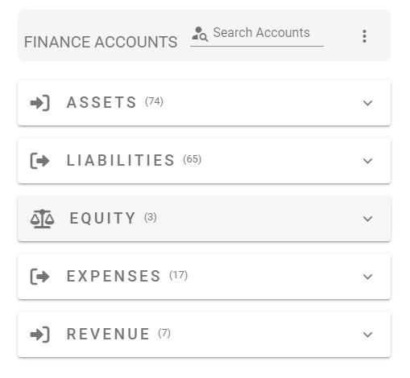
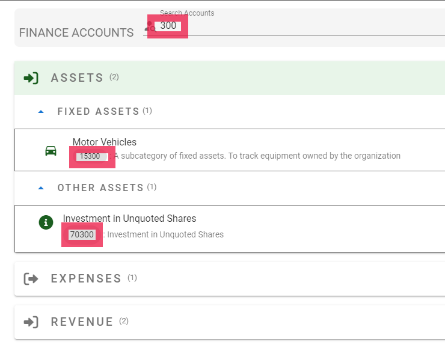
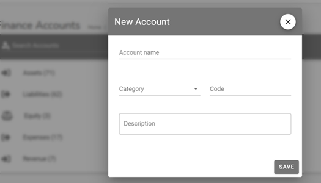

@autoHeader:13
# Finance Accounts Module

The `Finance Accounts` module is used to record the accounts that fund's transactions are recorded against.

## ACCESSING FINANCE ACCOUNTS 
><ins>**NOTE**</ins>\
>The **`FINANCE ACCOUNTS`** module can only be accessed by security group members with the [`finance_read_all`](10_admin_member-accounts?id=finance_read_all) permission. This would normally include the [`ADMIN`](10_admin_member-accounts?id=_1031-admin-group), [`TREASURER`](10_admin_member-accounts?id=_1034-treasurer-group) and [`COMMITTEE`](10_admin_member-accounts?id=_1032-committee-group) security groups.

To access the Finance Accounts module, click on the navigation menu as follows : `Admin Menu` &#8702;`Finance` &#8702; `Finance Accounts`.

<video src="static/video/Finance_Accounts_Accessing.mp4"
	width="400px" controls autoplay loop>
  
</video>

[Ledger Accounts](static/markdown/ledger_accounts.md ':include')

## SEARCH FINANCE ACCOUNTS 

Use the search bar `Search Finance Account` to find a particular account. Type a description, account code, account title to find a specific record.

<video src="static/video/Finance_Accounts_Searching.mp4"
	width="400px" controls autoplay loop>
  
</video>

## ADD A NEW FINANCE ACCOUNT

><ins>**NOTE**</ins>\
>The records in the **`FINANCE ACCOUNTS`** module can only be edited by security group members with the [`finance_write`](10_admin_member-accounts?id=finance_write) permission. This would normally include the [`ADMIN`](10_admin_member-accounts?id=_1031-admin-group) and [`TREASURER`](10_admin_member-accounts?id=_1034-treasurer-group) security groups.

Click on the three vertical dot menu on the Finance Accounts page and select the **`+Add`** option.
The `New Account` dialog page opens up. Use this page to enter a new account.

<video src="static/video/Finance_Accounts_Add_Edit.mp4"
	width="400px" controls autoplay loop>
  
</video>

