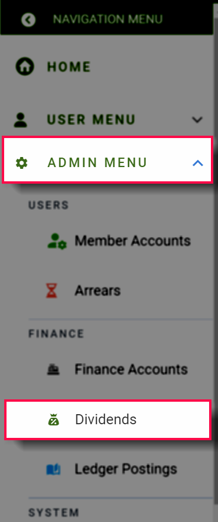
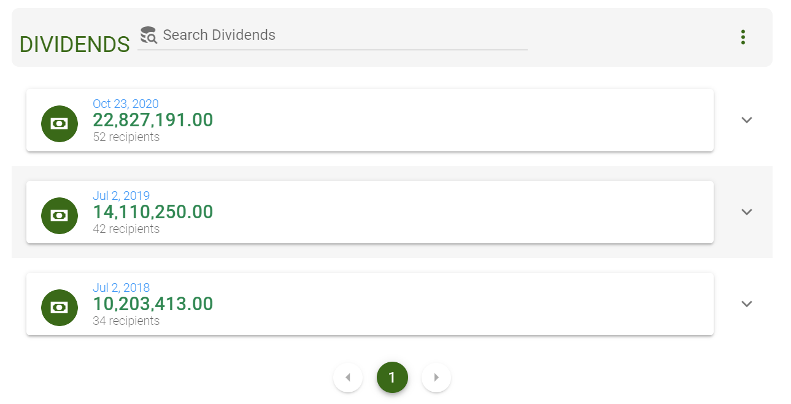
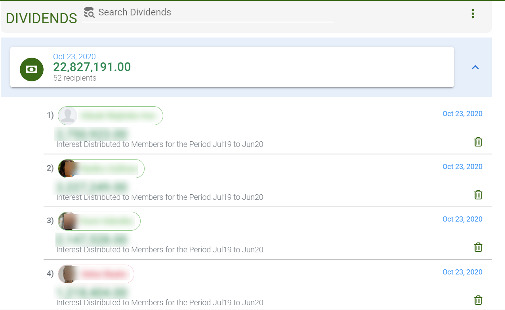
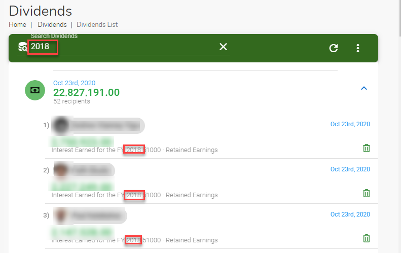
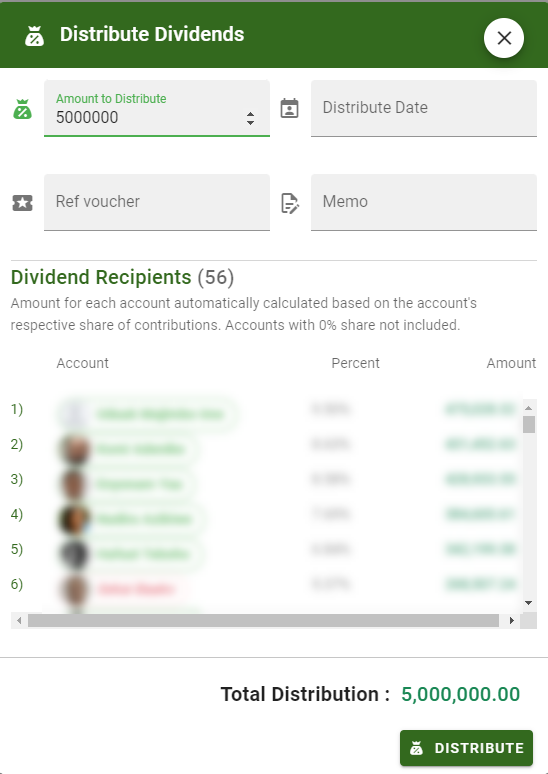

@autoHeader:14
# Dividends Module
The **`DIVIDENDS`** module allows the [**`TREASURER`**](10_admin_member-accounts?id=_1034-treasurer-group)  to distribute the club's investment earnings to the club members.

## ACCESSING DIVIDENDS
><ins>**NOTE**</ins>\
>The **`DIVIDENDS`** can only be accessed by security group members with the [`finance_read_all`](10_admin_member-accounts?id=finance_read_all) permission. This would normally include the [`ADMIN`](10_admin_member-accounts?id=_1031-admin-group), [`TREASURER`](10_admin_member-accounts?id=_1034-treasurer-group) and [`COMMITTEE`](10_admin_member-accounts?id=_1032-committee-group) security groups.

?> **ADDITIONAL INFO**\
 The distribution of dividends does not involve actual payments to members. 
 It simply transfers the equivalent dividend value from the club's 
 `Retained Earnings` ledger account to the respective member's `Savings Account`.

Access the **`DIVIDENDS`** module in one of the following ways :
1. From the Left navigation menu, Click  `ADMIN MENU` &#8702;`FINANCE` &#8702; `Dividends`.
1. From the Admin Quick menu, Click  `Dividends`.

<video src="static/video/Dividends_Accessing.mp4"
	width="400px" controls>
  
</video>

<!-- tabs:start >
#### **Dividends List**

.

#### **Open Dividends List**

.
<!-- tabs:end -->

## SEARCHING DIVIDENDS

Use the search bar `Search Dividends` to find a particular dividend. Type a either a name or a date or part of the memo in the search field to find what you are looking for.

<video src="static/video/Dividends_Search.mp4"
	width="400px" controls>
  
</video>

## DISTIRBUTE DIVIDENDS
><ins>**NOTE**</ins>\
>Distributing **`DIVIDENDS`** can only be done by security group members with the [`finance_write`](10_admin_member-accounts?id=finance_write) permission. This would normally include the [`ADMIN`](10_admin_member-accounts?id=_1031-admin-group)and [`TREASURER`](10_admin_member-accounts?id=_1034-treasurer-group) security groups.

> <ins>**NOTE**</ins>\
 The dividend amount to individual members is automatically calculated based on the respective 
 member's share of the total savings contributions. These amounts cannot be indivually changed.
 Also, members with 0% share cannot receive dividends.
 

From the three vertical dot menu on the **`DIVIDENDS`** module page, click the **`+ Add`** button.

The **`DISTRIBUTE DIVIDENDS`** dialog page opens up. Use this page to the amount to distribute 
and the effective date of the distribution.

<video src="static/video/Dividends_Distribute.mp4"
	width="400px" controls>
  
</video>
