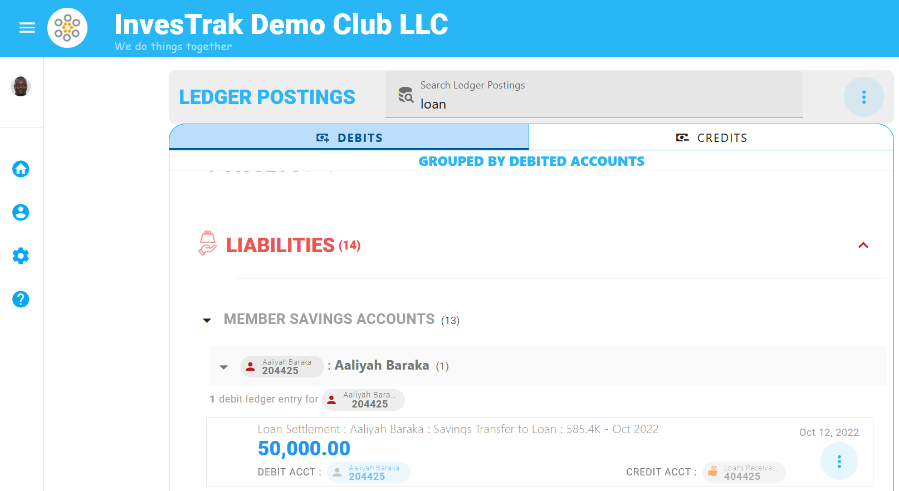
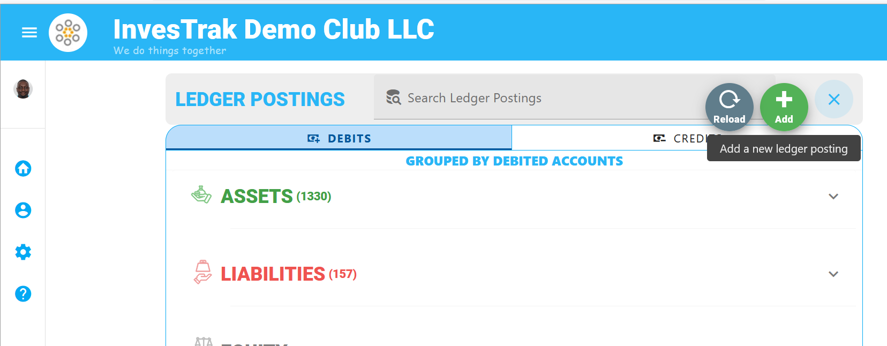
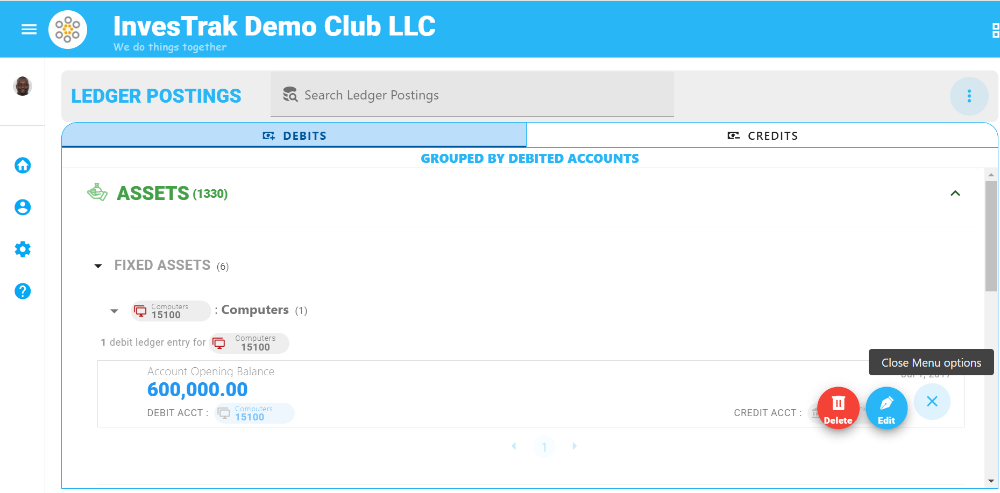

@autoHeader:16
# Ledger Posting Module
The Ledger Posting module allows the treasurer more granular control over the clubs's ledger transactions.

!> **WARNING**\
 Use this module with caution and only as a last resort. Most of the Club's transactions can be recorded through the other modules with other considerations already taken into account.

<video src="/static/video/Ledger_Postings.mp4" width="400px" controls autoplay loop>
  
</video>

## How it works
This module can be used to view all transactions for your club. Because it loads all transaction give it a moment to load all the information. 

<!-- embed:start:app settings -->

[Ledger Accounts](static/markdown/ledger_accounts.md ':include')

<!-- embed:end:app settings -->

## Search Ledger Postings
Use the search bar `Search Ledger Postings` to find a particular transactions. Type a either a name or a date or part of the memo in the search field to find what you are looking for.

## Manage Ledger Posting Records

### Add Ledger Posting
From the vertical 3 dots selection menu click on `Add` to open up a `New Posting dialog` window.

Enter the required fields and click on the `SAVE` button.

### Edit Ledger Posting
Identify the transaction you wish to edit. You can open the dialog using the `Edit` option in selection menu list or by just clicking directly on the record.

Make the necessary changes and Click on the `SAVE` Button.

### Delete Ledger Posting
Identify the transaction you wish to delete. Click the `Delete` option in selection menu list. Confirm delete in the dialog window that pops up and clcik `Delete again`.