@autoHeader:17
# APPLICATION SETTINGS

The **`APPLICATION SETTINGS`** module is used to administer the club specific settings. Because the operations and needs of each club are different, the platform offers some flexibility and enables some settings and modules to be turned on or off.

## ACCESS APPLICATION SETTINGS

><ins>**NOTE**</ins>\
>The **`APPLICATION SETTINGS`** module can only be accessed by security group members with the [`manage_site`](10_admin_member-accounts?id=manage_site) permission. This would normally include the [`ADMIN`](10_admin_member-accounts?id=_1031-admin-group) security group.

To access the Systems Settings module, click on the navigation menu as follows : `Admin Menu` ->`System` ->    `App Settings`.

<video src="static/video/System_settings_Accessing.mp4" 
    width="400px" controls autoplay loop>
  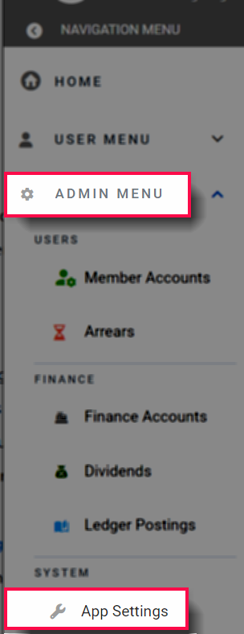
</video>

The **`APPLICATION SETTINGS`** module page is organized into 3 tabs, 
with each tab for a different set of configuration settings:

## APP TAB
The app settings tab is used to configure general defaults in the application

### CLUB DETAILS SECTION
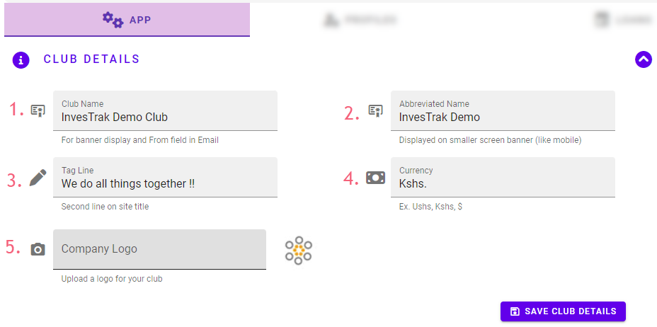

The **`CLUB DETAILS`** section is used to set the Club specific details and identification tags. There are 5 settings that can be changed:

1. `Club Name` - Will be displayed in the [**`TOP BANNER AREA`**](03_navigate-the-app?id=_31-the-top-banner-area) of the screen as well as the 'from' field in notification emails.

2. `Abbreviated Name` - Will be name displayed on the [**`TOP BANNER AREA`**](03_navigate-the-app?id=_31-the-top-banner-area) for smaller screens like mobile.

3. `Tagline` - A short phrase that is used to represent the club's values.

4. `Currency` - The currency symbol that will appear next to cash amounts.

5. `Company Logo` - The logo image that will be displayed on the site and emails sent. This is restricted to image files of type `PNG`.

### MONTHLY CONTRIBUTIONS SECTION

[Expected Contribution Warning](static/markdown/expected_contribution_warning.md ':include')

<!-- embed:end:expected contribution warning -->

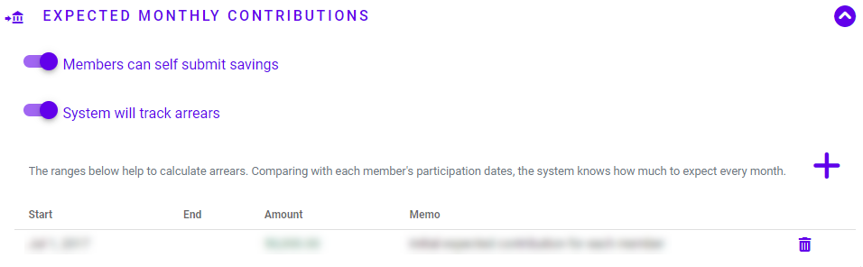

The **`MONTHLY CONTRIBUTIONS`** section enables to administrator to configure the following settings:

##### SELF SUBMIT SAVINGS 

<video src="static/video/Savings_Self_Submit.mp4" 
  width="400px" controls autoplay loop>
  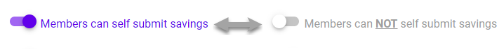
</video>

This is a master button to set whether or not the application platform will allow regular members to self submit their savings contributions. 

Usually, the [**`TREASURER`**](10_admin_member-accounts?id=_1034-treasurer-group) is responsible for entering all transactions into the platform. This means that whenever Club members make Savings contributions payments directly to the Bank, the [**`TREASURER`**](10_admin_member-accounts?id=_1034-treasurer-group) will need to be informed so as to update the records. The Self Submit feature enables the Club members to submit their transactions on the platform for review.

If the setting is turned on, the self submit controls will be enabled on the [**`SAVINGS`**](04_user_savings) module. Individual Club members can then submit their contributions into the platform with supporting attachment (receipt, bank slip etc). A workflow is then put in place so that the [**`TREASURER`**](10_admin_member-accounts?id=_1034-treasurer-group) will be notified and will need to review and approve before the submitted savings are added into the ledger and reflected against the Member's savings account.

##### TRACK ARREARS 

<video width="400px" controls autoplay loop 
	src="static/video/Track_Arrears_Setting.mp4">
  
</video>

This is a master button to set whether or not the platform will track the investment club's arrears based on the clubs **`EXPECTED CONTRIBUTIONS`** and individual member's [**`PARTICIPATION DATES`**](10_admin_member-accounts?id=_1024-participation-dates). If this setting is turned off, then no date ranges are expected and it is assumed that there is no fixed or regular required amount that the club expects from members.

##### EXPECTED CONTRIBUTION DATE RANGES

<video width="400px" controls autoplay loop 
	src="static/video/Contribution_Date_Ranges.mp4">
  
</video>

If the system has been set to track arrears, the administrator will use this table to add, delete and maintain the range of dates and corresponding amounts for **`EXPECTED CONTRIBUTIONS`**.The ranges are used to determine each members expected contribution and to calculate arrears. Comparing with each member's [**`PARTICIPATION DATES`**](10_admin_member-accounts?id=_1024-participation-dates), the system knows how much to expect every month.

<!-- tabs:start>
#### **Track Arrears **
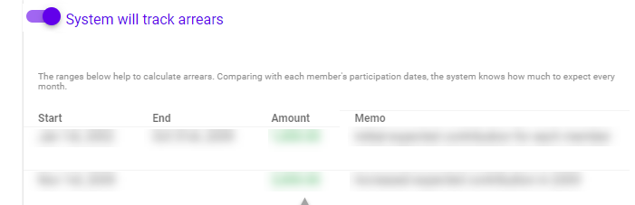

#### **Do Not Track**
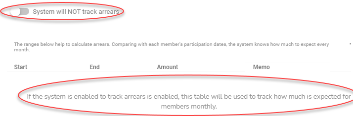

<!-- tabs:end -->

###### Edit Date Range
The Date ranges are added and managed using the `Edit Date Range` form. The form has the following fields: 

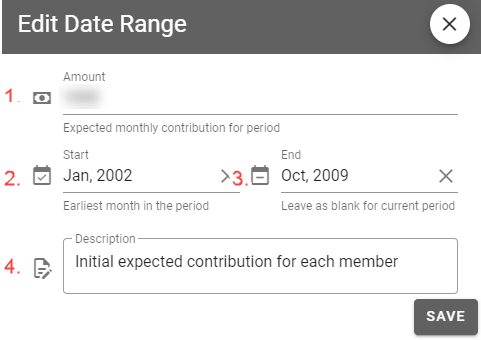

1. `Amount` - The amount that is expected every month for the period.
1. `Start` - The earliest month in the period. Note that these are stored as whole months.
1. `End` - The latest month in the period. This is left blank for the current on-going period.
1. `Description` - any additional information that provides additional information for the date range.

## PROFILE TAB
In this tab the administrator will find the settings that are used to configure different options for the profile record of each member who logs into the site.

Each of the settings can be switched on or off as required.

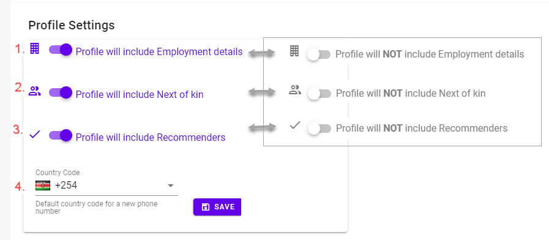

The settings are as follows:

1. Select whether the fields that record the members **Employment details** are required
2. Select whether the fields that record the members **Next of Kin** are required
3. Select whether the system needs to track whether the member was recommended by another member
4. Provide a country code that the system uses as default for recording phone numbers

## LOAN TAB
This tab is used by the administrator to set the default options that are applied to loans that the club provides to its members.

There are two options at the top of the page:

### ENABLE LOANS MODULE

This option setting determines whether the loans module is enabled or disabled. It provides clubs who do not use the loans facility with the option to turn the feature off.

If the Loans module is enabled, the other settings become available to configure as described below

### GENERAL LOAN SETTINGS
Below are the other configurable settings for the [**`LOANS`**](05_user_loans) Module

#### BYPASS LOAN APPLICATION WORKFLOW
<!-- embed:start:app settings -->

[Loan application workflow](static/markdown/loan_application_workflow.md ':include')

<!-- embed:end:app settings -->

<!-- embed:start:app settings -->

[Loan application bypass](static/markdown/loan_application_bypass.md ':include')

<!-- embed:end:app settings -->

#### SELF SUBMIT LOAN PAYMENTS

<video src="static/video/Loans_Self_Submit.mp4"
    width="400px" controls autoplay loop>
  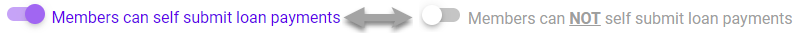
</video>
<!-- embed:start:app settings -->

[Loan application bypass](static/markdown/self_submit_loan.md ':include')

<!-- embed:end:app settings -->

This option setting determines whether the club administartors allow club members to submit their loan payments. If enabled it will provide the screens and the workflow that enable regular members to self submit payments that they have made to the bank and also enable the workflow for the treasurer to approve the submission.

### GENERAL LOAN OPTIONS
To confgure the default options that are new loan will have

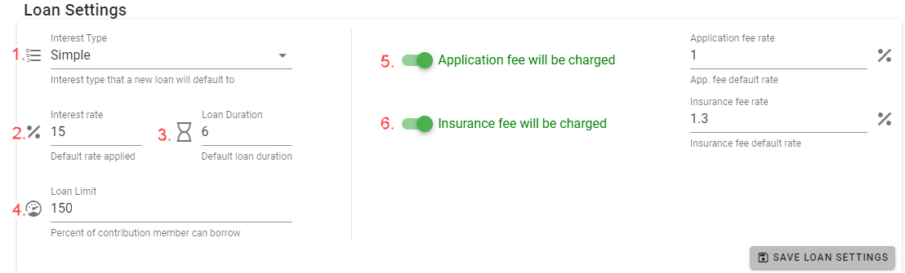

The following settings are available on how to manage loans:

1. `Interest Type` - There are two interest types - `Compound Interest` and `Simple Interest`. The Interest applied to loans will be determined by the interst type of the loan.

1. `Interest Rate` - This is the default Interest rate that is applied to a loan. If the interest type is set to `Compound Interest` the interest rate will be Annual Percentage Rate (APR) calculated monthly.  This setting only provides the default rate. The default rate can be changed for each individual loan by the loan committee or treasurer.

1. `Loan Duration` - This is the default period in months for which a loan should be paid back.The default duration can be changed for each individual loan by the loan committee or treasurer.

1. `Loan limit` - This is used to indicate how much a member can borrow. It is tied to the total contributions made by a member. For example 150 indicates that a member can borrow upto 150% (one and a half times) the amount they have contributed to the club

1. `Required Approvers` - This is used to determine the minimum set of approvers before a loan can be marked as approved in the applicatioon workflow. If there is no requirement to enforce minmum approvers then it can be set to zero.

### LOAN FEES
Some clubs charge an application fee and/or insurance fee when a loan is disbursed.

1. `CHARGE APPLICATION FEE` - If this setting is enabled, the system will charge a loan application fee. 
   
2. `APPLICATION FEE RATE` -  If the seeting is enabled, use the Text Box to enter the rate (as a percentage of the loan amount) at which the fee will be charged.

3. `CHARGE INSURANCE FEE ` -  If this setting is enabled, the system will charge a loan application fee. 

4. `INSURANCE FEE RATE` -  If the setting is enabled, use the text Box to enter the rate (as a percentage of the loan amount) at which the insurance fee will be charged.

### LOAN TYPES
Some clubs may have different types of loans that are offered to members based on different criteria. This section is used to add these different types of loans.

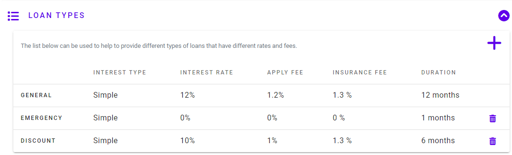

#### Add or Edit a loan type
You can add a new loan type using the Add New Loan Type button on the top of the table. You can also edit a loan type by click on it from the table. Use the Edit Loan Type Form to edit and save your changes.

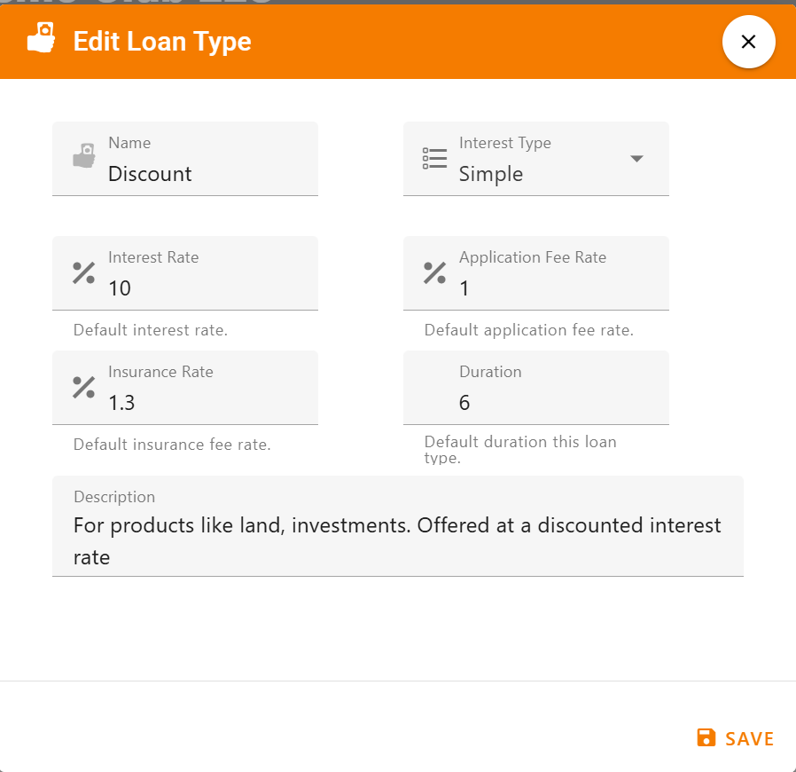

><ins>**NOTE**</ins>\
There is a loan type labeled **`GENERAL`** that is read only and provides the default loan settings for the club. It cannot be deleted or modified from the table. Whenever any of the default settings are modified in the above section, they will be reflected by this record.
