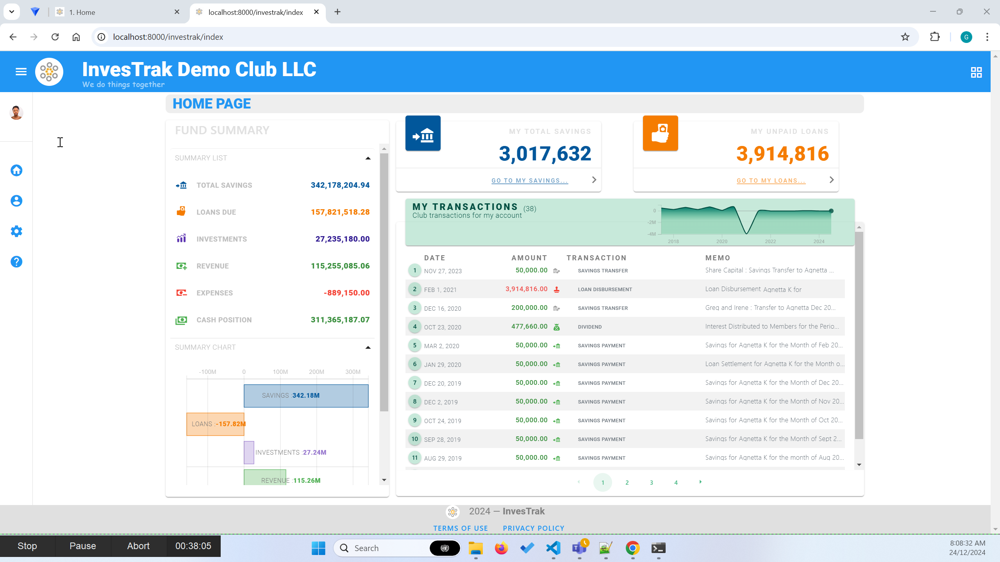

@autoHeader:1

# Home 

?>This guide provides you an introduction into the InvesTrak Application Platform 
and helps you navigate through its pages and modules so you understand how it works.

## Introduction
Welcome to InvesTrak Investment Club Platform. This is your Investment Club's Application user guide.
The InvesTrak application automates the management your investment club.

<video src="static/video/InvesTrak_Intro.mp4" width="90%" autoplay controls loop>
  
</video>

## How it Works
 InvesTrak is a web based online platform that enables investment club members to 
 access, manage and report on their club's finances at all times. The purpose of the application is as follows:

  1. Enable the Investment Club's [**`TREASURER`**](10_admin_member-accounts?id=_1034-treasurer-group) record, to track and report on the clubs activities with as little hassle as possible.
  1. Enable you as a member of the Investment Club to get an overall picture of the Investment Club, the activities, as well as the most updated financial status.
  1. Enable you as a member, to track your share of contributions and outstanding balances.

