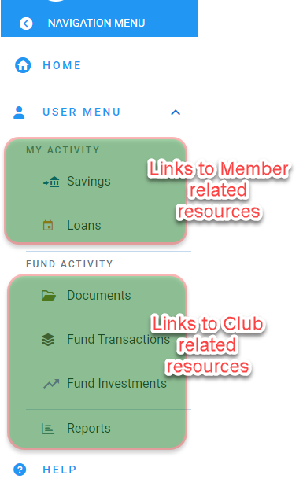

# Navigating the Application
The Application is built to allow easy access of all the screens and content using Navigation menus, the Top Banner area, and the  Main Content Page. After successfully logging in, these sections will be displayed.

## The Top Banner Area 
The top banner on the screen is available on every page of the application.

 It will display some additional icons and information as follows:
 
 - The `Navigation Menu Button` is displayed on the left side of the Top banner. Clicking it will open the navigation menu.

 - The `Club Logo` is displayed on the left side of the Top banner. Clicking it will navigate the member to the home page.

- The `Club Name` is displayed on the next to the Club Logo. It displays the name of the club.
 
- The `Admin QuickMenu` is only available to the admins of the Club. It provides shortcut menus to pages that are used for administrative tasks.

 - The `Member Drop-down` Icon provides the members with access to their profile, ability to reset their password or to log out from the site
 

## The Navigation Menus
The navigation menu helps you to intuitively and easily navigate  the applications  through the the different pages and find the relevant content. The menus are grouped into links with similar content - like user related resources (`My Savings` and `My Loans`) vs club related resources (like `Fund Activity` or `Fund Investments`). The groups of menus can be expanded to show the menu links under them or collapsed to reduce clutter.

## The Main Content Area
The main content area is a dynamic page area that is used to display the data that you have selected using the navigation menus or links from the top banner. This is the page that will show you the important content on the site.
