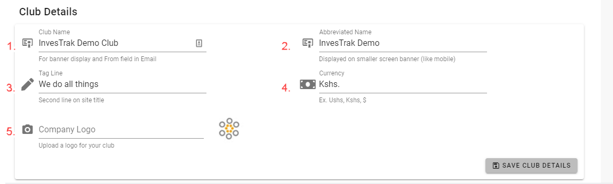
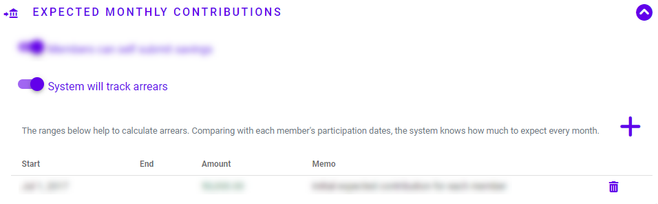
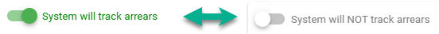
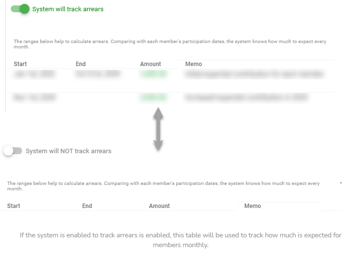
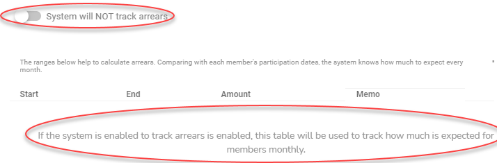
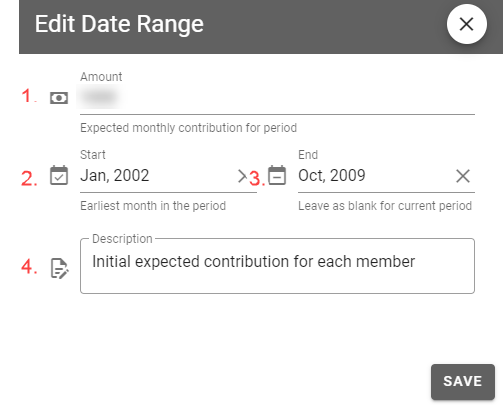

# App Settings
The app settings tab is used to configure general defaults in the application

## Club Details

The `Club Details` is used to set  the name of the Club. The club name that is set in this section is what appears on the top banner of the application. There are 2 settings that can be changed:

1. `Club Name` - Will be displayed in the top banner of the screen as well as the 'from' field in notification emails.

1. `Abbreviated Name` - Will be name displayed on the top banner for smaller screens like mobile.

1. `Tagline` - A short phrase that is used to represent the club's values.

1. `Currency` - The currency symbol that will appear next to cash amounts.

1. `Company Logo` - The logo image that will be displayed on the site and emails sent. This is restricted to image files of type `PNG`.

## Expected Monthly Contributions

!> **Caution** It is important that the administrator accurately records all `Expected Monthly Contribution` date ranges with no overlaps or gaps so that arrears and dues can be calculated correctly.

The Expected monthly contribtions section enables to administrator to set  the data ranges and corresponding amounts for the date ranges that the system expects savings contributions from each dues paying member. The ranges are used to determine each members expected contribution and to calculate arrears. Comparing with each member's [participation dates](member-accounts.md?id=participation-dates), the system knows how much to expect every month.

### Members can self submit savings 

This is a master button to set whether or not the club will allow regular members to self submit their contributions. If this is turned on, then self submit controls will be enabled regular members to submit their contributions and workflow put in place so that the Treasurer will be notified and will need to approve before the submitted savings are added into the account savings.

### System will track arrears 

This is a master button to set whether or not the club will track arrears. If this is turned off, then no date ranges are expected and it is assumed that there is no required amount that the club expects from members.

### Date Range Table

If the system has been set to track arrears, the administrator will use this table to add, delete and maintain the range of dates and how much is expected monthly for each active member.

<!-- tabs:start -->
#### **Track Arrears **

#### **Do Not Track**

<!-- tabs:end -->

#### Edit Date Range
The Date ranges are added and managed using the `Edit Date Range` form. The form has the following fields: 

1. `Amount` - The amount that is expected every month for the period.
1. `Start` - The earliest month in the period. Note that these are stored as whole months.
1. `End` - The latest month in the period. This is left blank for the current on-going period.
1. `Description` - any additional information that provides additional information for the date range.
