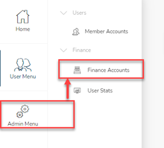
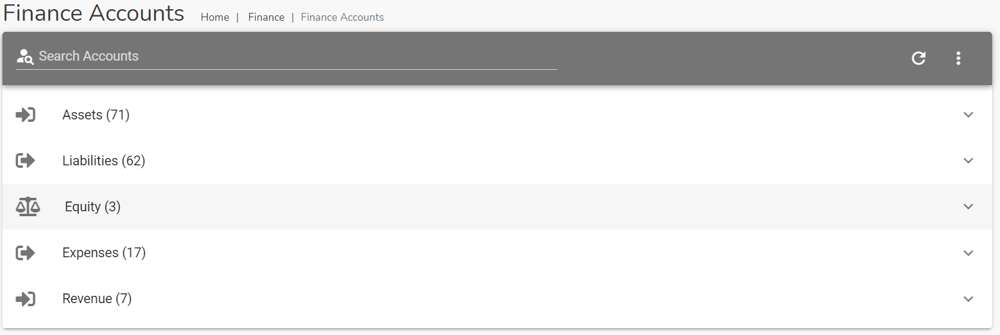
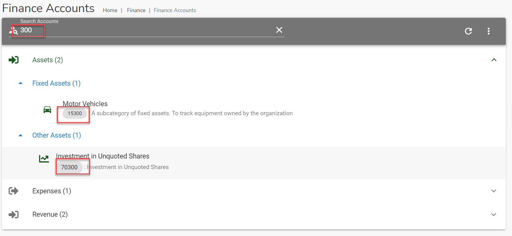
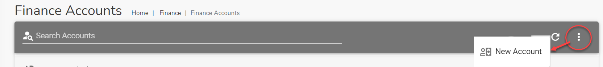
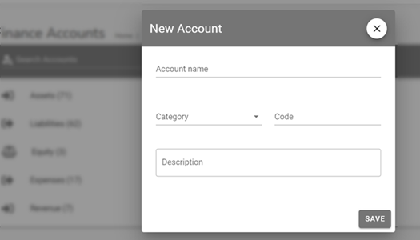

# Finance Accounts Module

The `Finance Accounts` module is used to record the accounts that fund's transactions are recorded against.

To be able to store transactions and report on them, the systm groups all transactions into several Financial accounts. These accounts are largely grouped into the following categories:

- `Assets` - to record transactions for any physical items of value that the club owns
- `Liabilities` - to record transactions on debts that the club owes
- `Equity` - to record share capital, dividends and to track what is left after subtracting liabilities from assets
- `Expenses` - to record all of the money and resources the club spends for operations or in the process of generating revenues
- `Revenue` - keep track of any income the club brings in from operations 

## Accessing Finance Accounts 
To access the Finance Accounts module, click on the navigation menu as follows : `Admin Menu` ->`Finance` -> `Finance Accounts`.

## Searching for a Finance Account 

Use the search bar `Search Finance Account` to find a particular account. Type a description, account code, account title to find a specific record.

## Add a new Finance Account

If your account has the required permissions you can add a new finance account. Click on the three vertical dot menu on the Finance Accounts page and select the `New Account` option.

The `New Account` dialog page opens up. Use this page to enter a new account.

