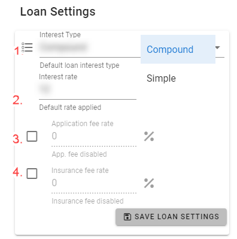
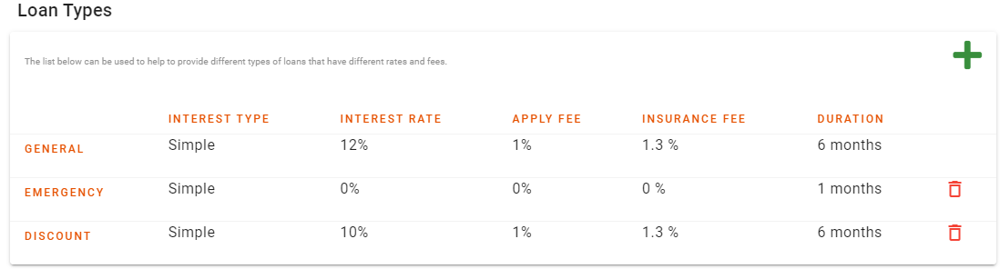
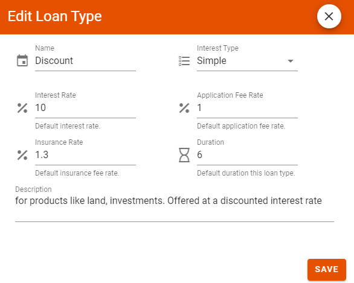

# Loan Settings
This tab is used by the administrator to set the default options that are applied to loans that the club provides to its members.

There are two sections:
## Configure Loan Settings
To confgure the default options that are new loan will have

The following settings are availbale on how to manage loans:

1. `Interest Type` - There are two interest types - `Compound Interest` and `Simple Interest`. The Interest applied to loans will be determined by the interst type of the loan.

1. `Interest Rate` - This is the default Annual Percentage Rate (APR) that is applied to a loan. This setting only provides the default rate. The default rate can be changed for each individual loan by the loan committee or treasurer.

1. `Loan duration` - This is the default period in months for which a loan should be paid back.The default duration can be changed for each individual loan by the loan committee or treasurer.

1. `Loan limit` - This is used to indicate how much a member can borrow. It is tied to the total contributions made by a member. For example 150 indicates that a member can borrow upto 150% (one and a half times) the amount they have contributed to the club

1. `Application fee Rate` - Some clubs charge an application fee when a loan is disbursed. Use the check box so that the system will charge a lona application fee. Use the Text Box to enter the rate (as a percentage of the loan amount) at which the fee will be charged.

1. `Insurance fee Rate` -  Some clubs charge an Insurance fee when a loan is disbursed. Use the check box so that the system will charge a lona application fee. Use the text Box to enter the rate (as a percentage of the loan amount) at which the insurance fee will be charged.

## Loan Types
Some club may have different types of loans that are offered to mem,bers based on different criteria. This section is used to add these different types of loans.

#3# Add or Edit a loan type
You can add a new loan type using the Add New Loan Type button on the top of the table. You can also edit a loan type by click on it from the table. Use the Edit Loan Type Form to edit and save your changes.

>Note there is a loan type labeled `General`that is read only and provides the default loan settings for the club. It cannot be deleted or modified from the table. Whenever any of the default settings are modified in the above section, they will be reflected by this record.
