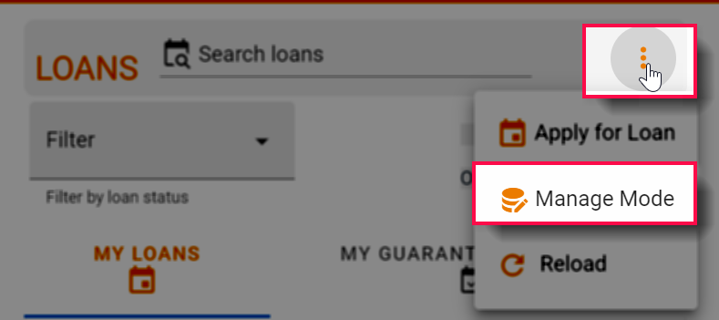
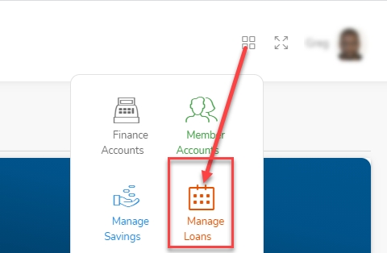
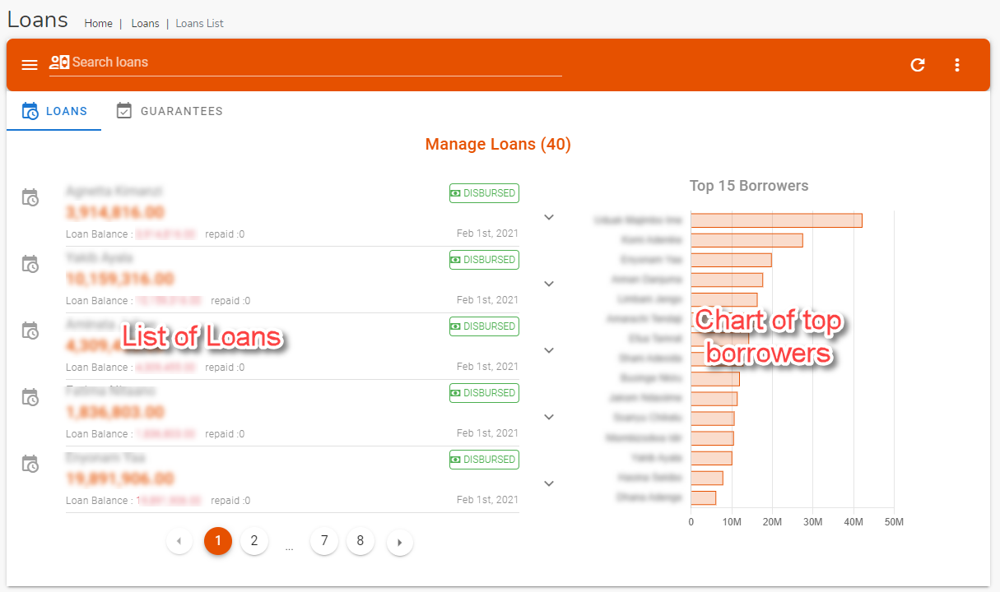
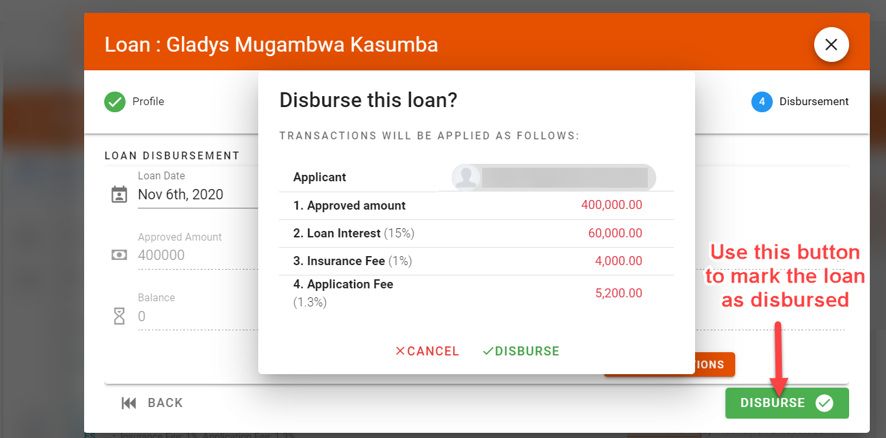
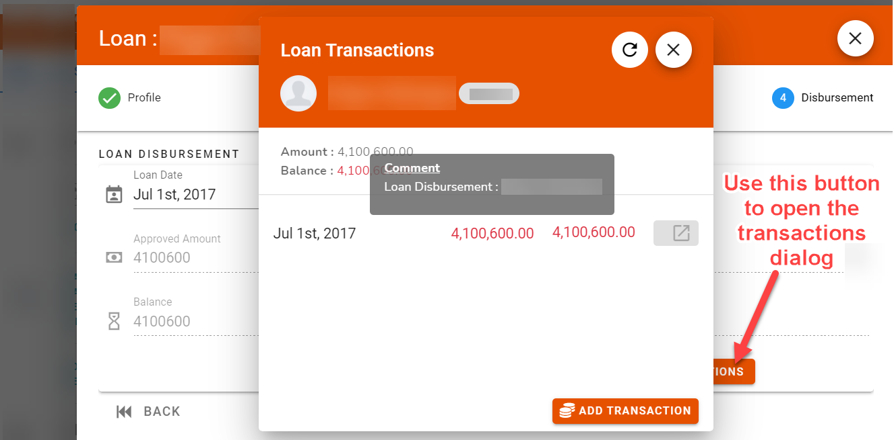

# Manage Loans
The Manage Loans  module is an extention of the [Loans](user-modules/loans.md) module. IT is used to perform additional functions like approving and disbursing loans.

## Accessing the Manage Loans
If your login has the required authorization (Committee Membership or `finance_read_all` permissions) then you will be able to access the module  in one of two ways:

1. Click on the three horizontal dot menu on the Loans page and select the `Manage Mode` option

2. Alternatively, you can access the module by clicking on the `Manage Loans` button located in the Quick menu in the [Top Banner arear](access-the-site/navigate-the-app?id=the-top-banner-area)

The Manage Loans module page displays the list of individual loan applications and a section showing a chart of top borrowers.

## Approving a loan
!> This function can only be done by club committee

After a member has submitted a loan request, an email notification will go out to all committee members. At least two committee members are required to approve the loan before it can be marked as approved. 

!>For committee members only

## Disbursing a loan
!> This function can only be done by club treasurer

After a loan has been marked as approved, the treasurer will then disburse the loan. The process of disbursement will add the various transactions (loan amount as well as any of the applied interest, processing fees and/or insurance charges).
!>For Treasurers only

>**Note** \
After a lona has been disbursed all loan  records (including type, charges and guarantors) approval will become read-only

## Loan Transactions
Once a loan has been approved and disbursed you can track the individual transactions on this tab
