# Manage Savings
!> This page can only be accessed by the `Admin`, `Treasurer` or member with the `finance_read_all` permission.

This module provides the Treasurer with the ability to be able to add contributions for members or to edit existing contributions.

## Accessing Manage Savings

If your account has the required authorization (Committee member or `finance_read_all` permission) you can access the manage savings module in one of two ways:

1. Click on the three vertical dot menu on the Savings page and select the `Manage` button.

&nbsp;&nbsp;&nbsp;&nbsp;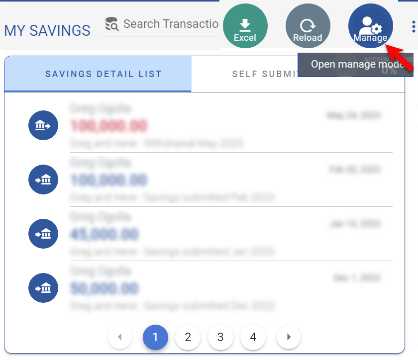.

2. Alternatively, you can access the module by clicking on the `Manage Savings` button located in the Quick menu in the [Top Banner arear](access-the-site/navigate-the-app?id=the-top-banner-area)

&nbsp;&nbsp;&nbsp;&nbsp;.

The Manage Savings module page displays the list of member transactions, a section on savings totals and a section on the monthly chart of all contributions.

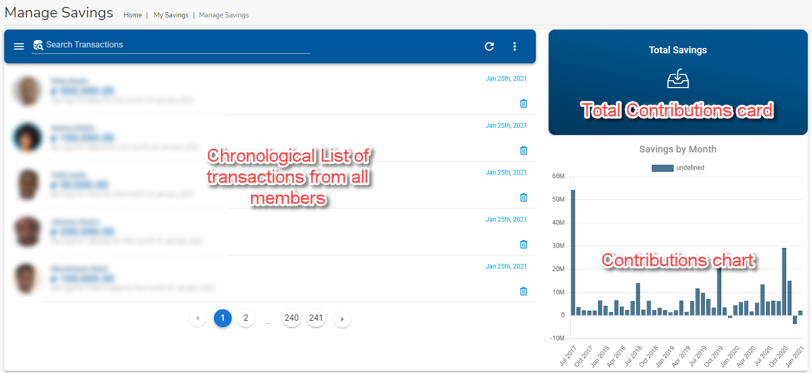.

## Edit Savings Transaction
- From the `Manage Savings` landing page, click on a Savings record to view its details.
- The `Edit Payment` dialog page is displayed with the Savings details. The details of the fields on the dialog are as follows:
    1. `Transaction Date` - A text field to capture the date when the transaction happened.
    1. `Amount` - The cash amount for the transaction.
    1. `Account` - A drop down field to select the member account associated with the savings transaction
    1. `Ref Voucher` - This is a text field that is used by some club to attach a reference voucher to a transaction.
    1. `Description` - A memo field that is used to capture any additional free text information about the transaction.
    1. `Arrears` - This line will only appear if the [Track arrears](admin-modules/app-settings?id=system-will-track-arrears) setting is turned on. It indicates the amount that the member owes in arrears. Clicking on it will open the [Arrears](user-modules/arrears.md) module.

&nbsp;&nbsp;&nbsp;&nbsp;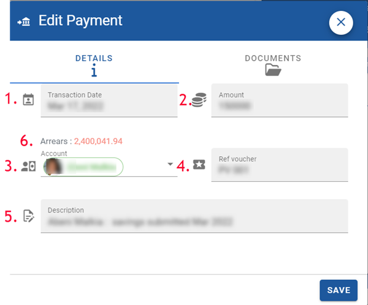.

## Manage Savings options

Click on the three vertical dot menu on the Manage Savings page and select any of the following options:

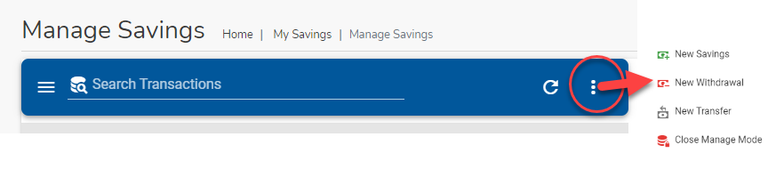.

### New Savings
- `New Savings` option is used to create a new savings transaction.
- The fields are exactly the same as described in the `Edit Savings Trnasaction` section above.

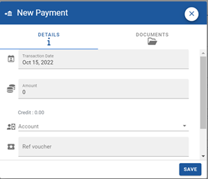.

### New Withdrawal
- `New Withdrawal` option is used to create a new withdrawal transaction.
- The fields are exactly the same as described in the `Edit Savings Trnasaction` section above.
- The difference with the options above is that the amount is deducted rather than added.

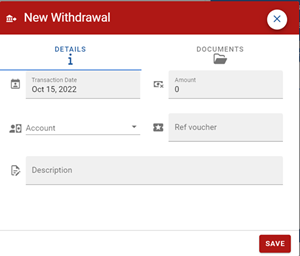.

### New Transfer
`New Transfer` option is used to create a new transfer between two members or between a member and another account(loan or share capital).

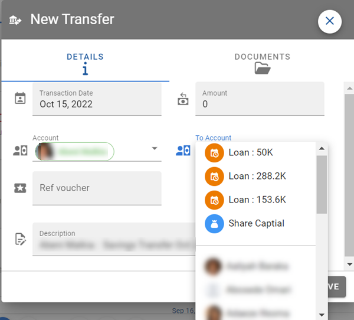.

- The difference with the `New Savings` and `New Withdrawal` options is that there is a FROM field and a TO field. The amount is deducted from the FROM account and added to the TO account.
- For the TO account, in addition to Member Savings accounts, money cn also be transfered to the following accounts:
    - The corresponding loan account of the FROM account (to pay outstanding loans with existing savings).
    - Share Capital account.

### Close Manage Mode
`Close Manage Mode` option to go back to the savings page
  

## Savings Documents
Each Savings record has the abilty to load associated documents (e.g. Bank Deposit slip etc.). 

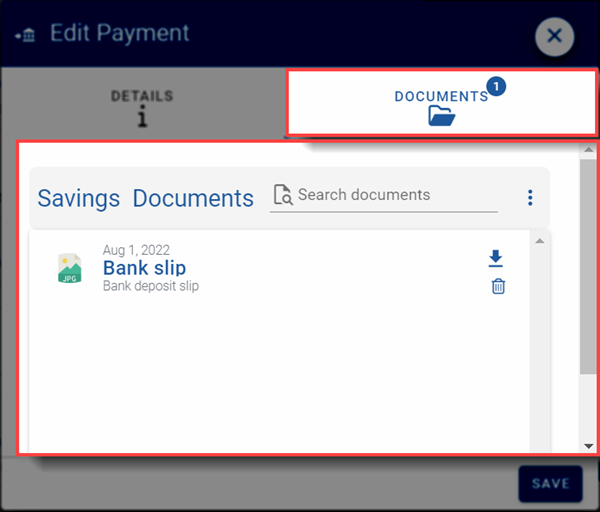.

1. From the `Manage Savings` landing page, click on an Savings record to view its details.
1. The `Edit Payment` dialog page is displayed with the Savings details.
1. Click on the `Documents` Tab to view the transactions.

Details on adding and working with documents can be found on the [`Documents`](user-modules/documents.md) page.

## Manage Self Submit Savings

If permitted by the Club Administrator or Treasurer, regular club members can record their own savings that they have submitted to the bank. There is a workflow in place so that the Treasurer will be notified and will need to approve before the submitted payment is added into the account savings.

Follow these steps to approve or decline a submission:

1. From the Manage Savings page navigate to the `SELF SUBMITTED SAVINGS` tab and select the self submitted record you would like to approve or decline.
   
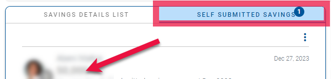.

>**Note.** \
>If you do not see the `SELF SUBMITTED SAVINGS` it means that your club has not been enabled for this feature. Check your [App Settings](admin-modules/app-settings.md).

2. The `Self Submitted Payment` dialog opens up. On the `DETAILS` Tab, review the details of the payments  that has been self submitted by the member to the bank. Most of the fields are pre-filled and you can edit them if you like.
   
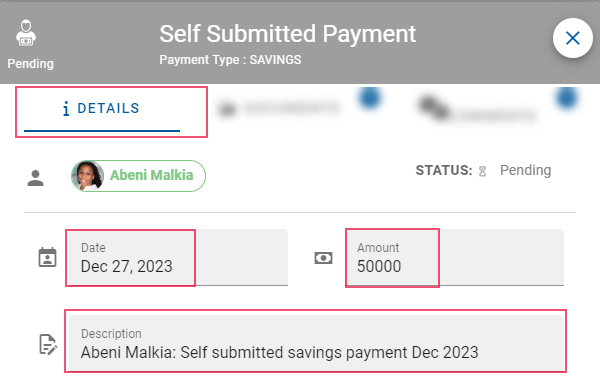.

1. Next, click on the `DOCUMENTS` Tab and review the upload an image of the bank slip or receipt that shows the bank transaction. This provides the proof needed to review and reconcile the recorded self submitted payment with the bank statements so that it can be approved.
   
&nbsp;&nbsp;&nbsp;.

4. If everything looks ok, click on the Grren `APPROVE` button. You can also reject submitted record by clicking on the `DECLINE` button.
5. .

>**Note.** \
>If more clarification is required after the record has been submitted both the Treasurer and the member can use the `COMMENTS` Tab of the record to provided additional information.

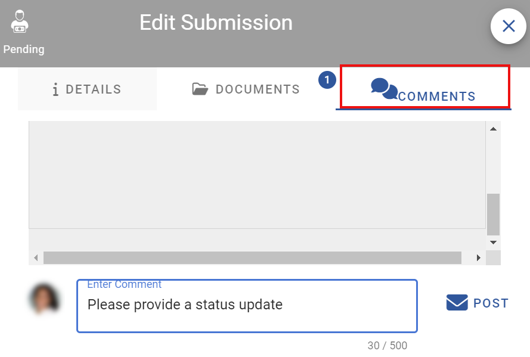.