# Member accounts
The `Member Accounts` module is used to administer the profile records of the fund members.

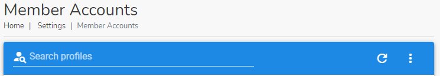.

## Accessing Member Accounts

!> This module can only be accessed by the [`Admin`](#admin-group), [`Treasurer`](#treasurer-group) or member with the [`finance_write`](#finance_write) or [`manage_member`](#manage_member) permissions.

To access the Member Accounts module, click on the navigation menu as follows : `Admin Menu` ->`Users` -> `Member Accounts`.

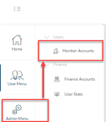.

 The landing page of the module is divived into 3 sections: 
- [`Member Profiles`](#member-profiles) - to edit an individual member’s profile. It can be used to add new users or edit such records as Name, email address, account, profile image or address.
- [`Security Groups`](#security-groups) - used to easily place login accounts into groups for which appropriate permissions can be assigned.
-  [`Accounts`](#accounts)

## Member Profiles
The Member Profiles is used to manage an individual member’s login profile. It can be used to add new users or edit such records as Name, email address, account, profile image or address.

.

### Adding a New Member Profile
Click on the three vertical dot menu on the Investment Records page and select the `New Profile` option.

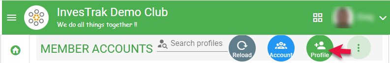.
### Create and edit profiles

.

### Searching for a member profile

Use the search bar `Search profiles` to find a particular member profile.Type a either a name, email address, phone number or part of the account number in the search field to find what you are looking for.

.

### Activate or disable Users
To login and use the platform a user's login needs to be active. All user accounts have one of the following statuses:

  - `Active` - This is the status that all members who login to the system will normally have. The status is denoted by the colour green.
  - `Pending` - When a member initially registers into the system the user's account is saved with this status. They will be unable to login until the administrator changes the status to `Active`. The admin cannot manually set an account to this status. The status is denoted by the colour orange.
  - `Disabled` - When a user leaves the investment club, the Administrator can disable the user's login by changing the status to `Disabled`. The member will be unable to login until the administrator changes the status to `Active`. The status is denoted by the colour red.
  
 

<!-- tabs:start -->
#### **Disble Profile **
To disable a user click on the  users `Activate or Deactivate` button in the `Member Accounts` page.

.

#### **Enable Profile **
To activate a user whose status is `pending` or `disabled` use the same users `Activate or Deactivate` button.

.

<!-- tabs:end -->

?> **Note** You cannot use the `status` button to change a user's status from something else to `pending`. The `pending` status is reserved for the system. A newly signed up user will automatically be marked as `pending`, until the admin changes this status. 

### Participation Dates
!> **Note** It is important that the Administrator accurately records all members' `Participation Dates` so that arrears and dues can be calculated correctly.

`Participation Dates` provide exact date intervals for which a specific member is expected to be an active, dues paying member of the fund. By recording exact date ranges, the system can then calculate how much everyone is expected to pay and from that determine arrears for each account. Add as many date ranges as necessary to fully describe the members dates of participation, especially if the member had many gaps in their membership.

.

####	Add Participation dates
To add a participation date click on the `Add Participation date` button.

.

In the `New Date Range` page, provide the following information:

.

- `Name` – This is pre-selected based on the member record under which the add button was clicked. It can not be changed.
- `Joined` – Select the date joined or the date rejoined after the member had previously left.
- `Left` – This is blank if the member is active under this date range.
- `Description` – Additional information regarding the participation date record.
- `Leave Memo` – Additional information that can be added when the participant left.

### Send Statements
As part of the regular updates given to members, the [`Treasurer`](#treasurer-group) or [`Admin`](#admin-group) can send a statement financial statement by email to any or all members so that they are kept up to date even if he or she does not access the system. Follow the steps outlined below to to send statements by email to the members.

<!-- tabs:start -->
#### **Initiate  **
Click on the `STATEMENTS` button to start the process.

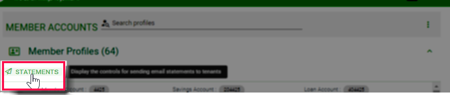.

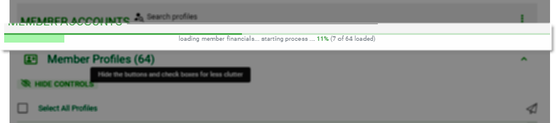.

#### **Email Controls **
 Once the data is loaded and the controls become available, you can use them to select the profiles that you want to send  email statements to. 

.

#### ** Confirm dialog **
The email dialog is displayed with the member account(s) to send the email statement to. Before sending, you can preview the statement.

.

#### **Preview Statement**

.

#### **Send Statement**
When ready use the `Email Statements` -> `Send` buttons to send the statements the the selected members.
 
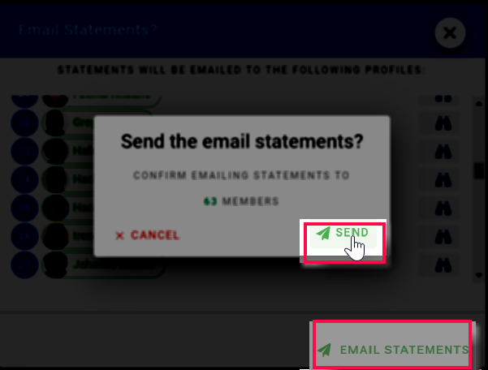.
<!-- tabs:end -->

## Security Groups

Security groups are used to easily place login accounts into groups for which appropriate permissions can be assigned.

The following Security groups are setup by default for the club

### Admin Group
The Admin Group is designed to provide overall site administartion for the club. By default it has been setup to have all the [`Security permisions`](#security-permissions) described below.

### Committee Group
The committee group is designed to provide visibility to all the club's records without neccessarily being able to add, delete or change the records. This is suited for committee members who are expected to review and discuss all matters of the club and contribute to  working level decisions. By default the committee group has the [`finance_read_all`](#finance_read_all) permission.

### Secretary Group
The committee group is designed to manage the club's documentation. By default the secretary group has the [`manage_docs`](#manage_docs) permission.

### Treasurer Group
The Treasurer group is designed to manage the club's financial information. Treasurers are ususally By default the Treasurer group has the  [`finance_read_all`](#finance_read_all),  [`finance_write`](#finance_write)  [`manage_docs`](#manage_docs) permissions.

### Users Group
The Users group includes all authenticated members of the club. Users can log into the system and view their own finances - savings, loans and arrears. Users can also view fund transactions and fund investments. By Default there are no additional elevated permissions provided to this group. 

<!-- tabs:start -->

#### **Groups List **

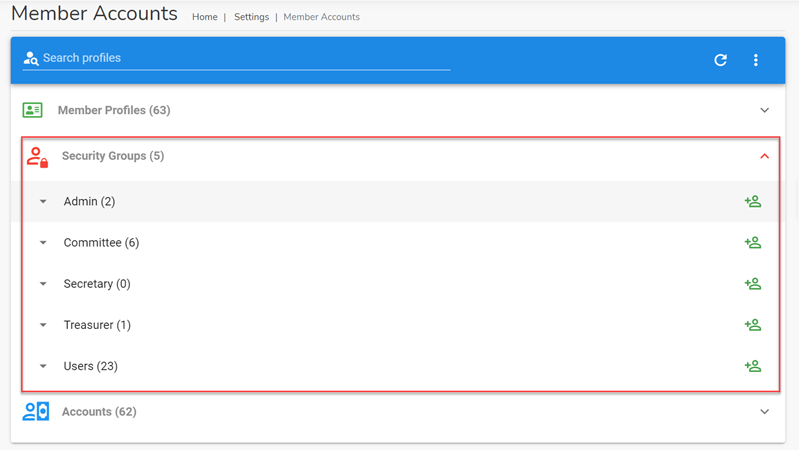.

#### **Admin Group **

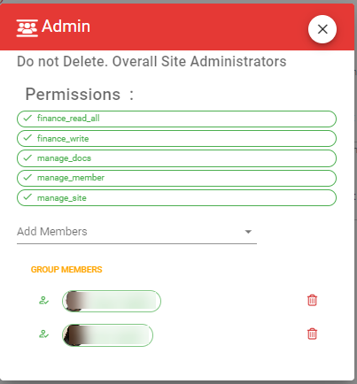.

#### **Committee Group **

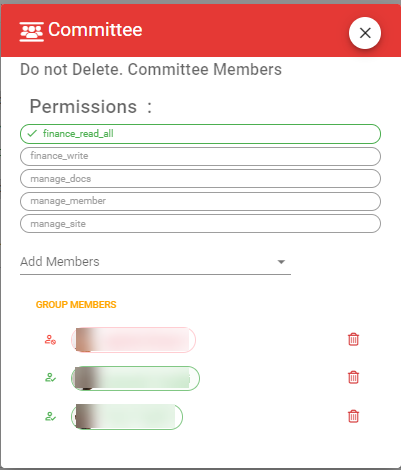.

#### **Secretary Group **

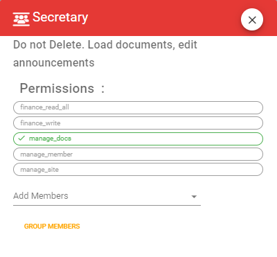.

#### **Treasurer Group **

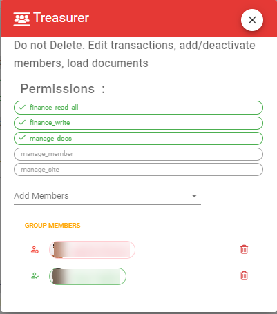.

#### **Users Group **

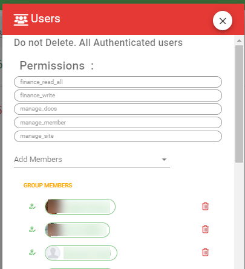.

<!-- tabs:end -->

### Security Permissions

#### finance_read_all
Authenticated club members who have this permission can read all the club's financial information. This includes all savings, all loans, all arrears, all dividend distributions and fund transactions. This permission goves read only permission.

#### finance_write
Authenticated club members who have this permission can read and write all the club's financial information. In addition to the [`finance_read_all`](#finance_read_all) permission, members with this permission will be able to add, edit and delete savings records,  loan records, investment records and fund transactions.

#### manage_docs
Authenticated club members who have this permission can add, edit and delete club documents.

#### manage_member
Authenticated club members who have this permission can read and manage member profile information. This includes adding/editing a new profile or a new member account, adding/editing participation dates for a member

#### manage_site
Can read and write site settings that control the functioning of the site. This includes provisioning of permissions to different secirty groups.

## Accounts
All paying members of the fund should be associated with an account. An account is the entity to which savings contributions, loans, and loan payments to or from the fund are attributed to. An account can contain one or more users. Although expected contributions depend on each individual in an account, the amounts are reflected against the account.

 
### Adding a New Account
Click on the three vertical dot menu on the Investment Records page and select the `New Account` option.

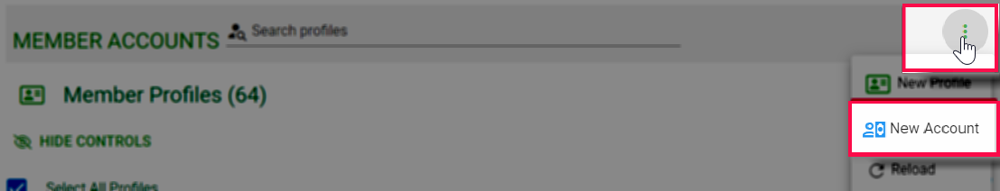.