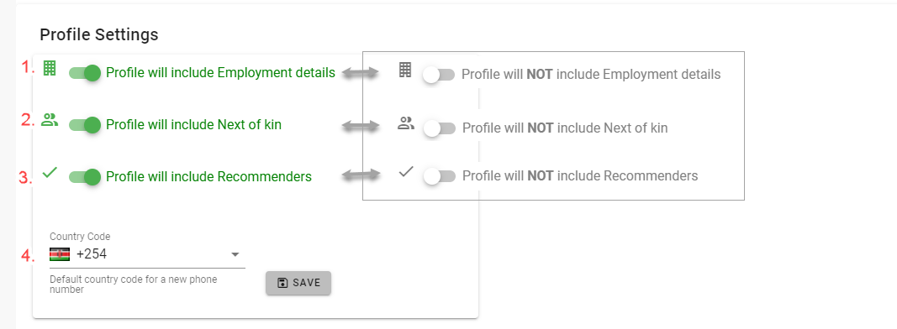

# Profile Settings
In this tab the administrator will find the settings that are used to configure different options for the profile record of each member who logs into the site.

Each of the settings can be switched on or off as required.

The settings are as follows:

1. Select whether the fields that record the members **Employment details** are required
1. Select whether the fields that record the members **Next of Kin** are required
1. Select whether the system needs to track whether the member was recommended by another member
1. Provide a country code that the system uses as default for recording phone numbers