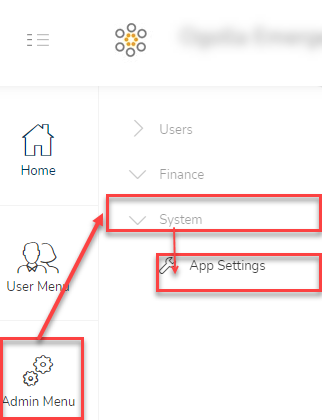

# System Settings module
!> This page can only be accessed by the `Admin` or member with the `manage_site` permissions.

This module is used to administer the club specific settings. Because the operations and needs of each club is different, there are some settings and modules that can be turned on or off and in some cases conifgurations that are set differently depending on the club needs.

## Accessing Systems Settings
To access the Systems Settings module, click on the navigation menu as follows : `Admin Menu` ->`System` ->    `App Settings`.

There are 3 tabs at the administrator’s disposal:
1. [App Settings](admin-modules/app-settings.md)
1. [Profile Settings](admin-modules/profile-settings.md)
1. [Loan Settings](admin-modules/loan-settings.md)

