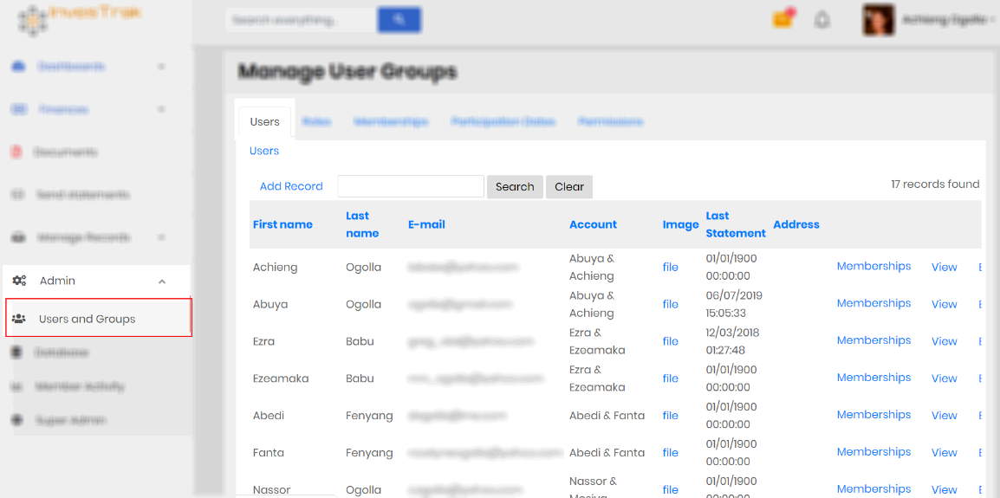
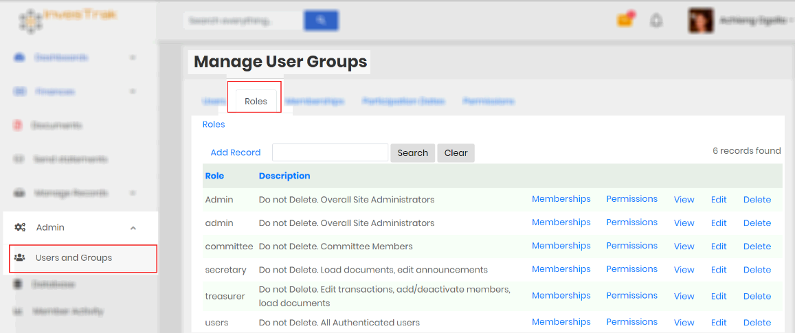
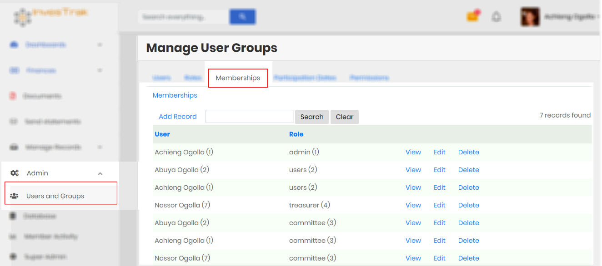
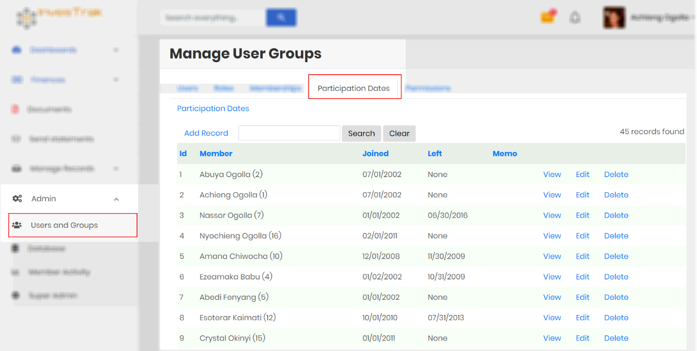
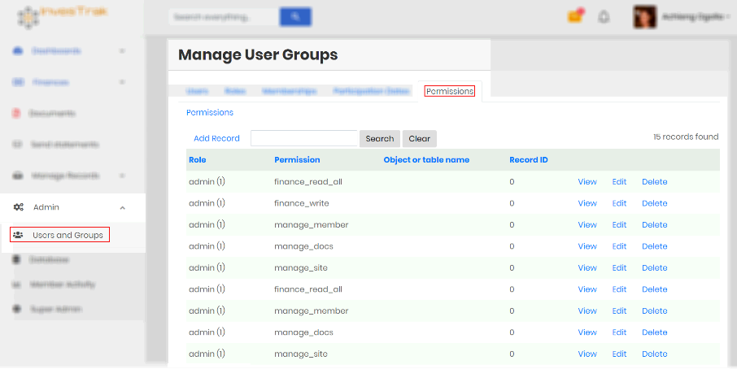
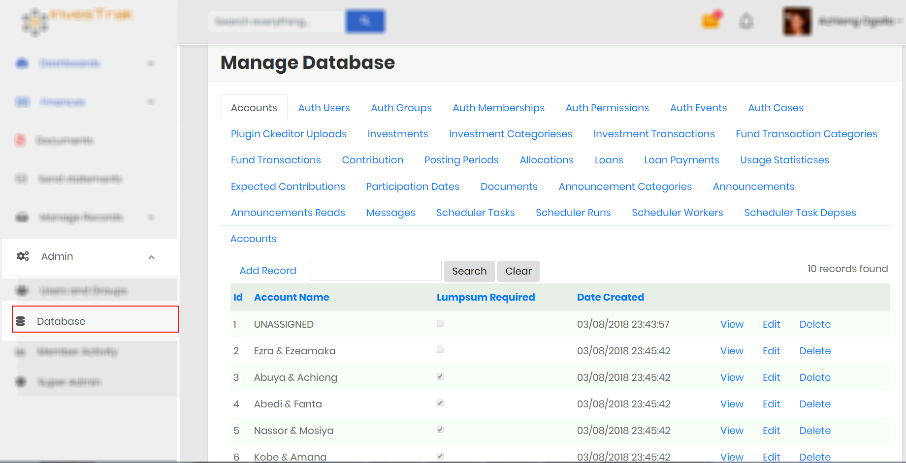
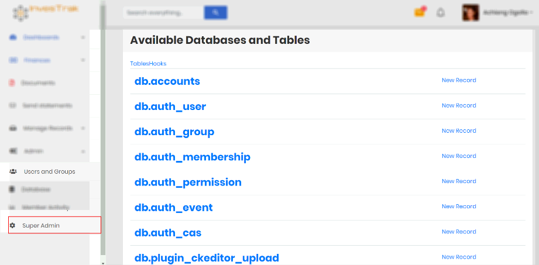

#	Admin Section
!>This section is only accessible to the Administrator. It should be used with care to ensure data is not lost or corrupted.

##	Manage Users and groups
This section is used to administer the records of the fund members. There are several Tabs at the administrator’s disposal.

###	Users
The `Users` Tab is used to edit an individual member’s profile. It can be used to add new users or edit such records as Name, email address, account, profile image or address.

!>**Note** The email address is also used as the login credential. While it can be changed, care should be exercised to avoid confusion. Also ensure there is no other member with duplicate email address.

###	Roles
`Roles` are synonymous to User groups. They are used to easily place login accounts into groups for which appropriate permissions can be assigned.

!> **Note** The existing `Roles` should not be deleted as the application logic requires them to ensure access to different resources and pages is provided correctly

###	Memberships
`Memberships` tab is used to add or remove roles from individual user login. A user can be assigned one or more  memberships.

###	Participation dates

!> **Note** It is important that the Administrator accurately records all members `Participation Dates` so that arrears and dues can be calculated correctly.

`Participation Dates` provide exact date intervals for which a specific member is expected to be an active member of the fund. By recording exact date ranges the system can then calculate how much everyone is expected to pay and from that determine arrears for each account. Add as many date ranges as necessary to fully describe the members dates of participation , especially if the member had many gaps in their membership.

###	Permissions
This tab provides permission to the `Roles` (or Groups). Care should be taken in changing existing permissions to ensure that respective default roles are able to access the right pages in the application.

##	Manage database
This section provides a view that allows the administrator to access and manipulate records in the database. It should be used with care and a full understanding of the data schema.

##	Super Admin
This section is used by the administrator to display the native system back-end interface.

