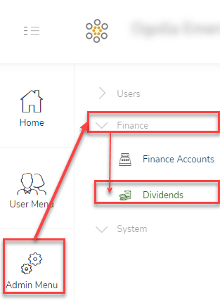
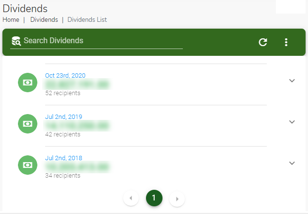
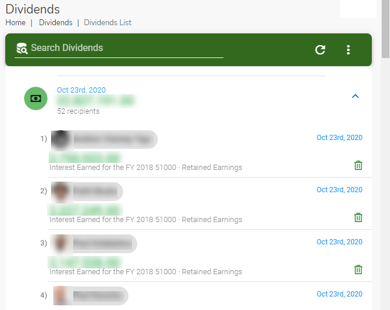
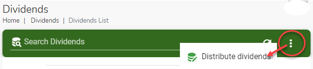
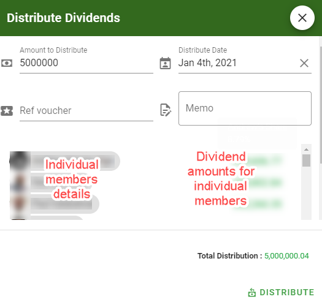

# Dividends Module
This module allows the treasurer to distribute the club's investment earnings to the club members.

## Accessing the Dividends module
To access the  module, click on the navigation menu as follows : `Admin Menu` ->`Finance` -> `Dividends`.

?> **Note** The distribution of dividends does not involve actual  payments to members. It simply transfers the equivalent dividend value from the club's `Retained earnings` account to the repective member's `Savings account`.

 |  Dividends List             |  Open Dividends List  |
  :-------------------------:|:-------------------------:
 | 

## Searching for a dividend

Use the search bar `Search Dividends` to find a particular dividend.Type a either a name or a date or part of the memo in the search field to find what you are looking for.

## Distribute Dividends

If your account has the required permissions you can distribute dividends. Click on the three horizontal dot menu on the Investment Records page and select the `Distribute Dividends` option.

The `Distribute Dividends` dialog page opens up. Use this page to the amount to distribute and the effective date of the distribution.

?> **Note** The dividend amount to individual members is automatically calculated based on the respective member's share of the total savings contributions. These amounts cannot be indivually changed.

