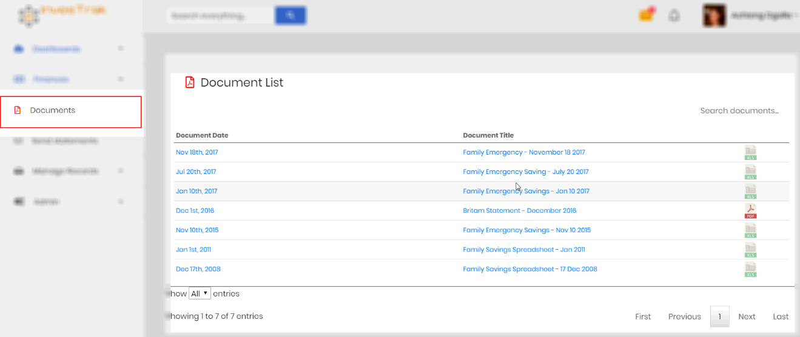
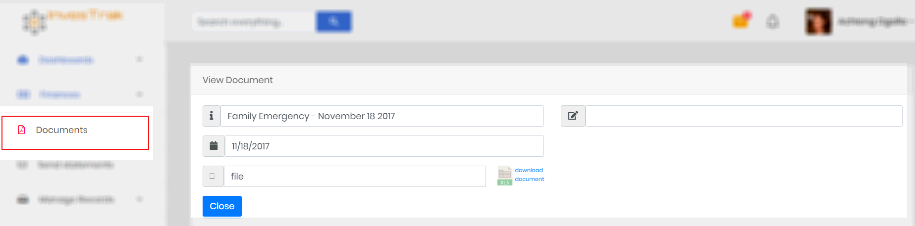

# Documents
The company secretary will be able to add and remove documents from this section. Members will be able to view & download any company documents posted here such as meeting minutes and bank statements.

 

Clicking on the document record opens the `View Document` page to display the document details.

Details of the loan record include:

- `Document Title` – A descriptive title by which the document can be identified.
- `Document Date` – The date the Document was uploaded.
- `File Upload` – If the user has permission this is the button to upload the document file.
- `Memo` – Any additional information regarding the transaction.
