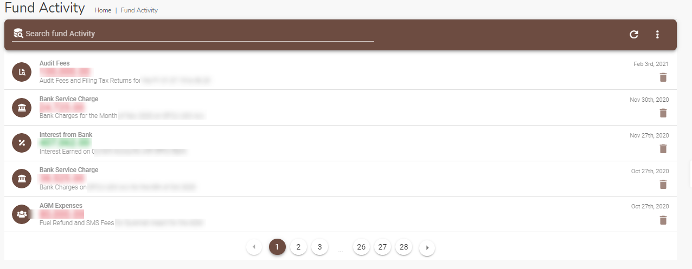

# Fund Activity
This page displays a table which lists the details of transactions carried out by the Fund (Revenue or Expense). 

## Accessing the Fund activity module
To access the Fund activity module, click on the `Fund Activity` link from the navigation menu.

The Fund Activity module is used to record all other transactions – expenses, audit fees, bank charges etc.

## Searching for a Fund  transaction 

Use the search bar `Search fund activity` to find a particular transaction. Type a memo, date, amount, account title to find a specific record.

## Add a new Fund transaction

If your account has the required permissions you can add a new fund transaction. Click on the three horizontal dot menu on the Fund Transactions page and select the `New Transaction` option.

The `New Transaction` dialog page opens up. Use this page to enter a new transaction.

