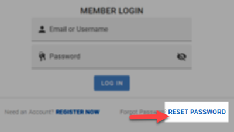
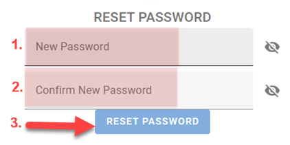
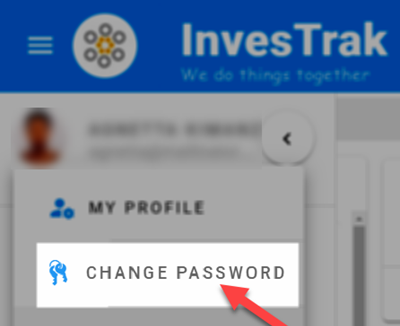

@autoHeader:2
# Access The Site

To access the webpage and application, you will need to know the name your club uses on the InveTrak platform.

For example if you club name is demo, the URL will be :
[https://www.investrak.club/demo](https://www.investrak.club/demo).

Replace the last part of the URL (demo in tihs example) with the name of your investment club

## Logging In
When you get to the InvesTrak site for the first time, or if you have been idle on the site for a while, you will be redirected to the login page. The login page is the door between your web browser and the InvesTrak website. By logging in you confirm your identity to the system, so that the content is provided to you securely.

Log in as show below.
<!-- tabs:start -->
#### **Enter your credentials**

1. Enter your email address  or your username
1. Enter your password
1. Click on the `Log in` button

#### **Login confirmation**
A message will appear on the top right to show you are `Logged in`.

<!-- tabs:end -->

## Managing your credentials
If you loose you password and you would like to reset it or you just want to change an old password, you can use the steps outlined below.

###	Resetting lost password

If you are unable to login or you forgot password , you can reset password as show below. Click on the different tabs to walk through the steps to reset your password.

<!-- tabs:start -->

#### **Click to Reset **
Click on the `Reset Here` button at the bottom of the login screen

 

#### **Request Reset **

Request a password reset as follows:

 

  1.	Provide your email address.  
  1.	Click on the `Request reset password` button

#### ** Reset Confirmation **
  A confirmartion page displays acknowledging recipt of the request.

   

#### ** Reset Email **
  You’ll receive an email with a link to reset your password.
   
  
#### ** Reset Password **
Click on the email link to be directed to the page to reset your password.

 

1. Enter your new password
1. Enter your password again to confirm
1. Click on the `Send Request` button

<!-- tabs:end -->

###	Changing your password

If you know your password and want to change it proceed as follows. Click on the different tabs to walk through the steps to change your password.

<!-- tabs:start -->
#### **Click to Change **
Select `Change Password` option from the user profile drop down list.

 

#### **Change Password **

Change your password as follows:

 

1. Enter your old password.  
1. Enter your new password
1. Enter your password again to confirm
1. Click on the `Change Password` button
  
<!-- tabs:end -->