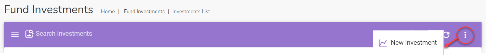
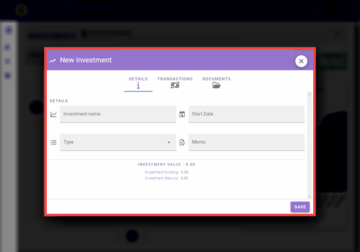

# Investments Module

This module is used to display and manage the details of the Invetsments made by the club

## Accessing the investments module

To access the Investments module, click on the navigation menu as follows : `User Menu` ->`Fund Activity` ->  `Fund Investments`.

The Investments page will display a list of all invetsment records

## Searching for a Investment record

Use the search bar `Search Investments` to find a particular transactions.Type a either a title or a date or part of the account number in the search field to find what you are looking for.

## Add a new Investment Record

If your account has the required permissions you can add a new Investment Record. Click on the three horizontal dot menu on the Investment Records page and select the `New Investment` option.

The `New Investment` dialog page opens up. Use this page to enter a new transaction.

