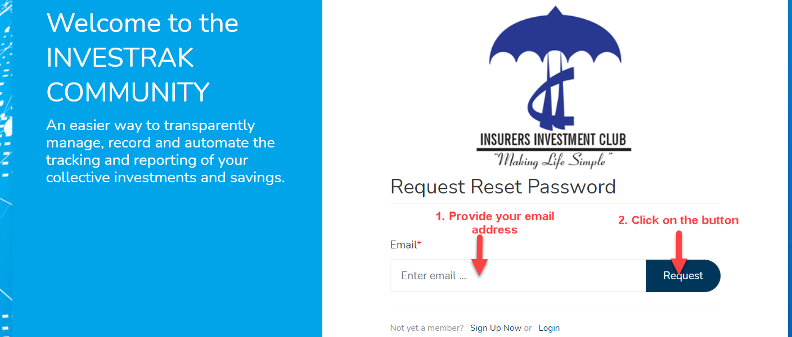
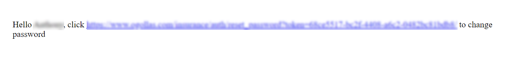
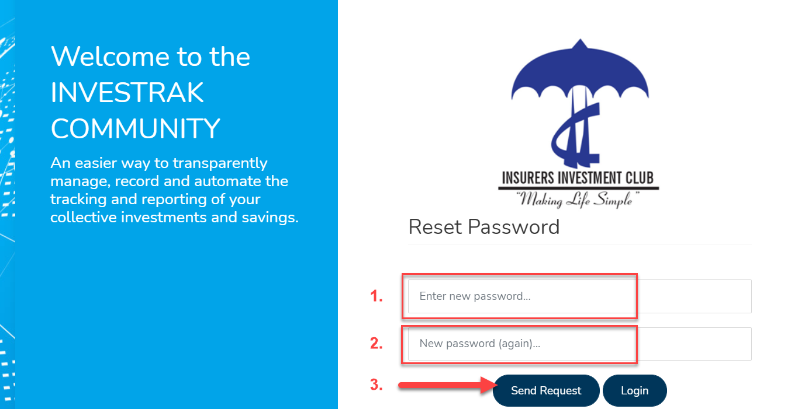
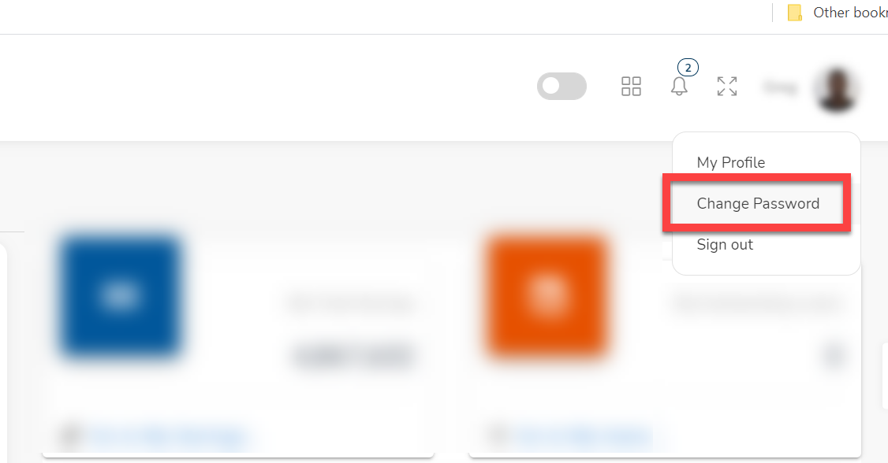
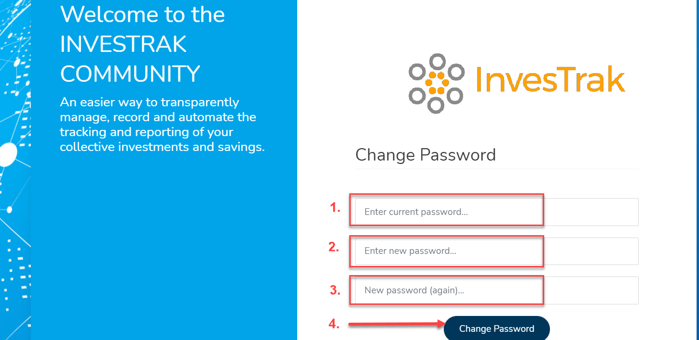

# Access The Site
To access the webpage and application, here is the URL:
[https://www.ogollas.com/insurance-dev](https://www.ogollas.com/insurance-dev)

##	Logging In
<!-- tabs:start -->
#### **Enter your credentials**

1. Enter your email address  or your username
1. Enter your password
1. Click on the `Log in` button

#### **Login confirmation**
A message will appear on the top right to show you are `Logged in`.

<!-- tabs:end -->

##	Resetting lost password

If you are unable to login or you forgot password , you can reset password as show below:
<!-- tabs:start -->
#### **Click to Reset **
Click on the `Reset Here` button at the bottom of the login screen

 

#### **Request Reset **

Request a password reset as follows:

 

  1.	Provide your email address.  
  1.	Click on the `Request reset password` button

#### ** Reset Confirmation **
  A confirmartion page displays acknowledging recipt of the request.

   

#### ** Reset Email **
  You’ll receive an email with a link to reset your password.
   
  
#### ** Reset Password **
Click on the email link to be directed to the page to reset your password.

 

1. Enter your new password
1. Enter your password again to confirm
1. Click on the `Send Request` button

<!-- tabs:end -->

##	Changing your password

If you know your password and want to change it as follows:

<!-- tabs:start -->
#### **Click to Change **
Select `Change Password` option from the user profile drop down list.

 

#### **Change Password **

Change your password as follows:

 

1. Enter your old password.  
1. Enter your new password
1. Enter your password again to confirm
1. Click on the `Change Password` button
  
<!-- tabs:end -->
