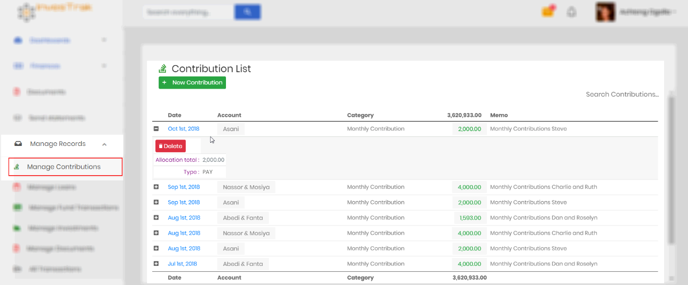
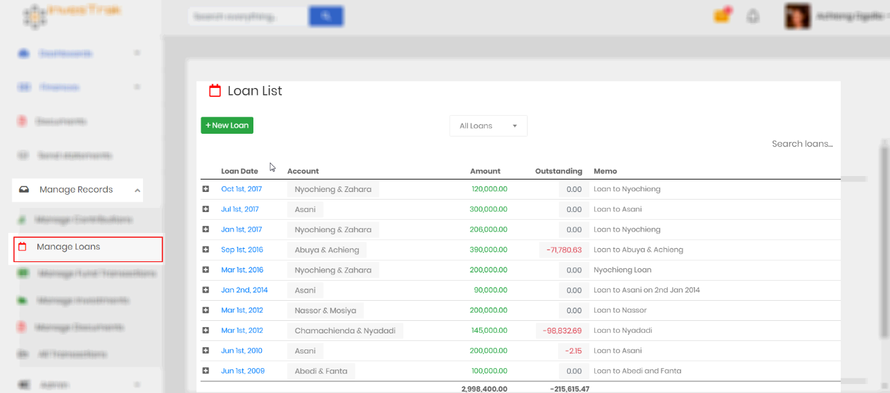
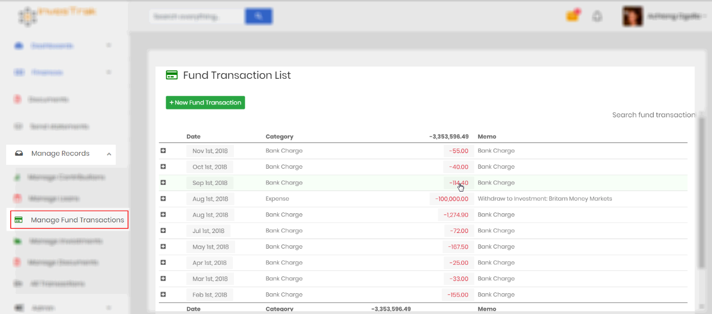
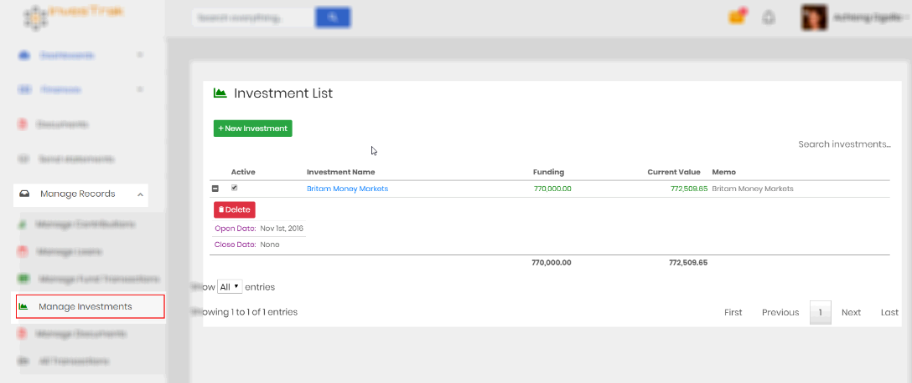
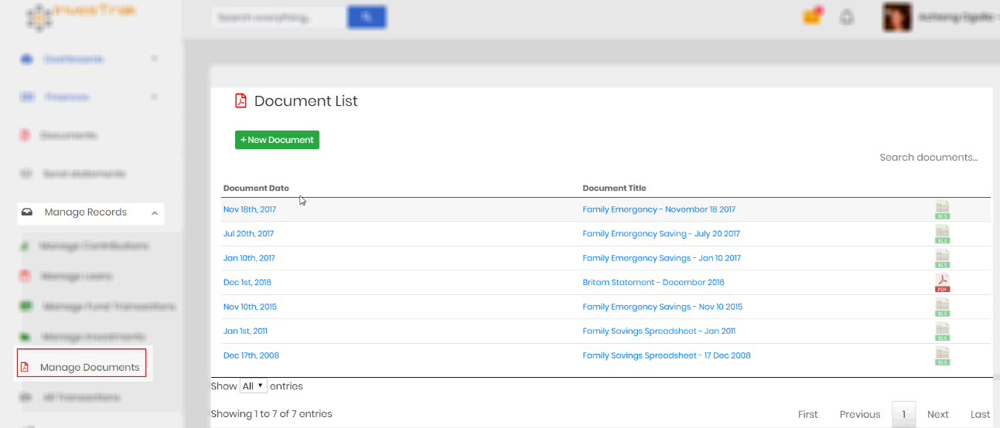

# Manage records

?> As a committee member, you’ll have an additional area labeled `Manage Records`. In this section, you’ll have several additional links to allow administration of the site. Menu links in this area are visible depending of the access permission of the logged in member. The `Admin`, `Treasurer` or member with the permission `finance_write` will be able to add, edit and remove transactions. All other committee members or member with the permission `finance_read_all` will be able to view all transactions. The sections will be `View All Records` instead.

## Manage Contributions

!>Editing, adding or deleting contribution records can only be done by the `Admin`, `Treasurer` or member with the permission `finance_write`. Other committee members or member with the permission `finance_read_all` can view all contribution records in read-only mode.

This page used to Add, Edit or Delete records for contributions made by members. The page is similar to the [My Contributions](finances.md#my-contributions) page with a few extra buttons - `New Contribution` and `Delete` for each record - which allows for managing the records.

## Manage Loans

!>Editing, adding or deleting loan records can only be done by the `Admin`, `Treasurer` or member with the permission `finance_write`. Other committee members or members with the permission `finance_read_all` can view all contribution records in read-only mode.

This page used to Add, Edit or Delete records for loans disbursed to members. The page is similar to the [My Loans](finances.md#my-loans) page with a few extra buttons - `New Loan` and `Delete` for each record - which allows for managing the records.

## Manage Fund Transactions

!>Editing, adding or deleting fund transaction records can only be done by the `Admin`, `Treasurer` or member with the permission `finance_write`.

This page is used to Add, Edit or Delete fund transactions. The page is similar to the [Fund Transactions](finances.md#fund-transactions) page with a few extra buttons - `New Fund Transaction` and `Delete` for each record - which allows for managing the records.

## Manage Investments

!>Editing, adding or deleting investment records can only be done by the `Admin`, `Treasurer` or member with the permission `finance_write`.

This page is used to Add, Edit or Delete Investment records. The page is similar to the [Investments](finances.md#manage-investments) page with a few extra buttons - `New Investment` and `Delete` for each record - which allows for managing the records.

## Manage Documents

!>Editing, adding or deleting documents can only be done by the `Admin`, `Treasurer` or member with the permission `finance_write`.

This page is used to Add, Edit or Delete document records. The page is similar to the [Documents](documents.md) page with a few extra buttons - `New Document` and `Delete` for each record - which allows for managing the records.

## List All Transactions

!>This is a read-only page. It can only be viewed by the `Admin`, `Treasurer` or member with the permission `finance_write`.

This page is used for reconciliation. It combines and lists all transactions in chronological order with a running total. It is useful to compare with bank statements for determining cash position.

