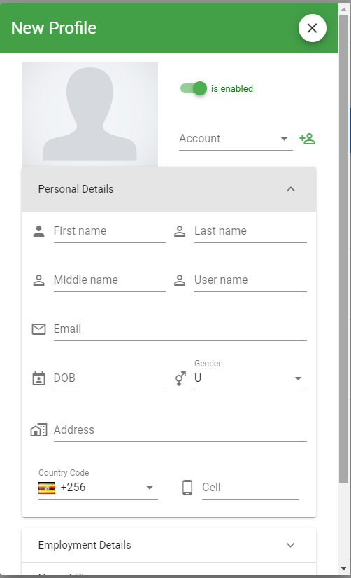
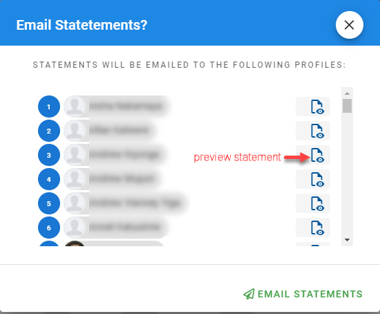
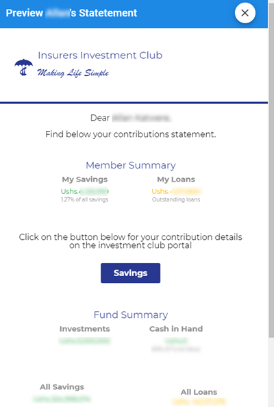

# Member accounts
!> This page can only be accessed by the `Admin`, `Treasurer` or member with the `finance_write` or `manage_member` permissions.

This section is used to administer the records of the fund members. There are several sections at the administrator’s disposal.

## Member Profiles
The Member Profiles is used to edit an individual member’s profile. It can be used to add new users or edit such records as Name, email address, account, profile image or address.

### Create and edit profiles

### Send Statements
 It is used to email statements to all or selected members.

|  Email Dialog               |  Preview Statement       |
:----------------------------:|:-------------------------:
| 

 
