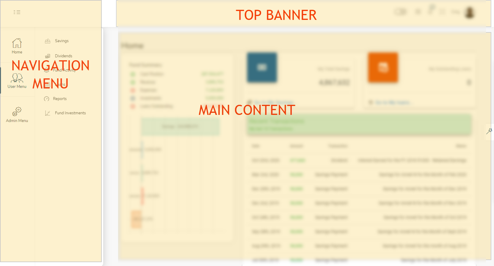

# Navigating the Application

The Application is built to allow easy access of all the screens and content using Navigation menus, the Top Banner area, and the  Main Content Page. After successfully logging in, these sections will be displayed.

## Company Logo
The company logo is always displayed on the top left corner of the screen. It shows the Title and the Logo of the Application. Clicking on the logo from any page, navigates to the [Fund dashboard](dashboards.md#fund-dashboard) page which is considered the home page.

## The Top Banner Area
 The top banner on the screen will display some additional icons and information. It displays the [Search Box](top-banner.md#search-box), [Messages](top-banner.md#messages), [Announcements](top-banner.md#announcements) and a [User profile drop-down](top-banner.md#user-drop-down) that allows you as the user to [manage  your password](top-banner.md#change-password), [manage your own profile](top-banner.md#member-profile) and also to [log off](top-banner.md#log-out) from the site.

## The Navigation Menus
The navigation menu helps you to intuitively and easily navigate  the applications  through the the different pages and find the relevant content. The menus are grouped into links with similar content - like dashboards or finances and the groups of menus can be expanded to show the menu links under them or collapsed to reduce clutter.

## The Main Content Page
The main content page is a dynamic page that is used to display the data that you have selected using the navigation menus or links from the top banner. This is the page that will show you the important content on the site.
