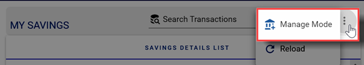

# Savings Module
Displays details of savings contributions made for each account. 

## Accessing the savings module

To access the savings module, click on the `Savings` Link from the navigation menu.

The savings module page displays the list of individual transactions, a section on savings totals and a section on the individual members share.

## Accessing the manage savings module

If your account has the required permissions yuu can access the manage savings module. Click on the three horizontal dot menu on the Savings page and select the `Manage Mode` option

## Searching for a transaction

Use the search bar `Search Transactions` to find a particular transactions.Type a either a name or a date or part of the memo in the search field to find what you are looking for

## Manage Savings Transactions

Click on the three horizontal dot menu on the Manage Savings page and select any of the following options:

- `New Savings` option to create a new savings transaction
- `New Withdrawal` option to create a new withdrawal transaction
- `New Transfer` option to create a new transfer between two members
- `Close Manage Mode` option to go back to the savings page
  

