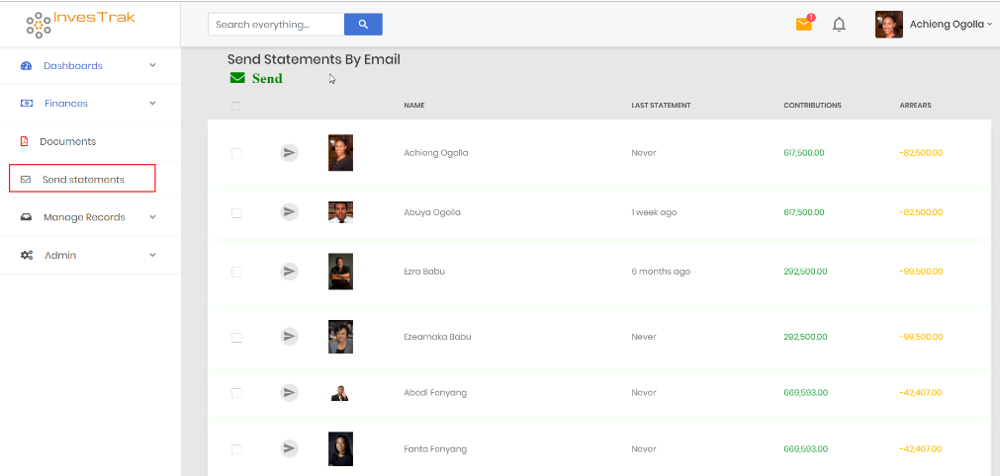

# Send Statements
!> This page can only be accessed by the `Treasurer` or member with the `finance_write` permission. It is used to email statements to all or selected members.

The parts of this page are as follows:

- `Send Button` – this button  is used to send account statements by email to all selected members.
- `Select/Unselect All` – this check-box used to quickly select or un-select all members that are to be sent account statements.
- `Name` – name of the Member that can be sent an account statement. Note statements can only be sent to members who are currently active.
- `Last Statement` – a time-stamp showing the last time a statement was emailed to the member.
- `Contributions` – total contributions made for the account for which the member is part of.
- `Arrears` - total arrears calculated for the account for which the member is part of.
 
 
