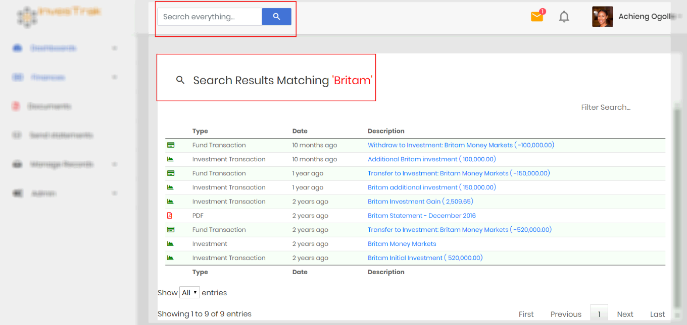
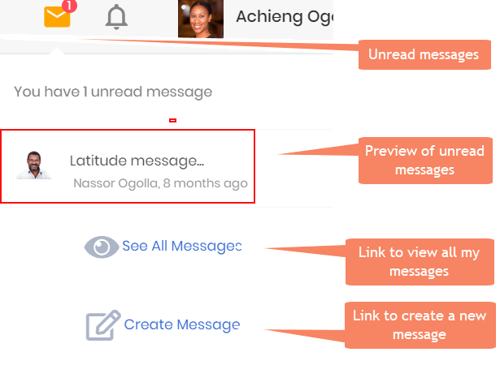
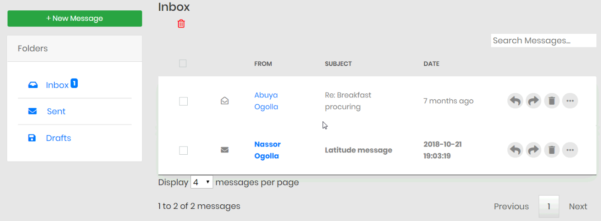
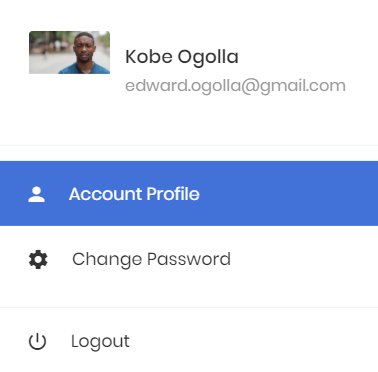
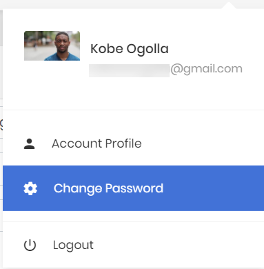
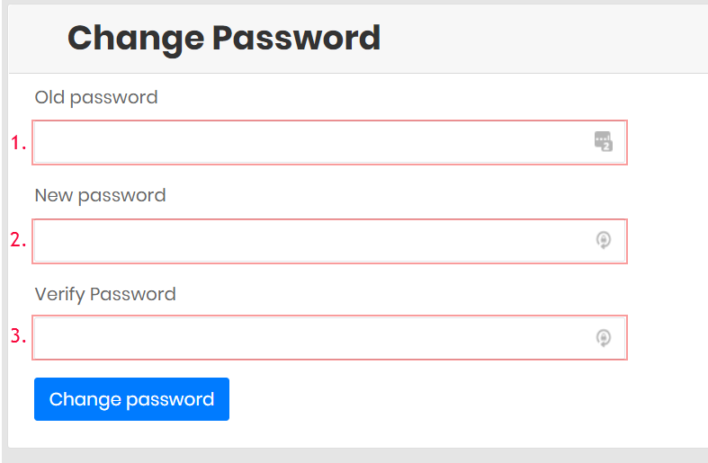
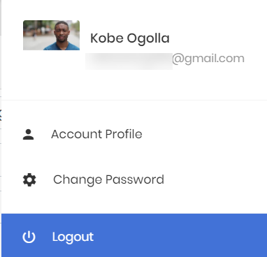
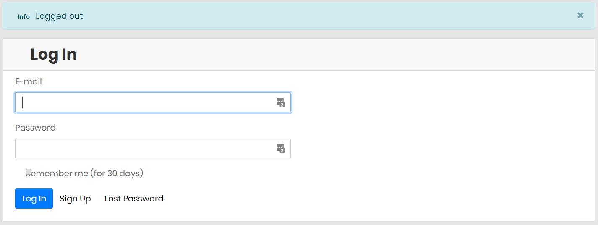

# Top Banner Content
Below is a deeper look at the buttons found on the Top banner

## The Search Box
The Search Box searches through the different records and returns content matching the search term.

When searching through application, the content will be displayed according to the logged in user’s access to the content that matches the search string submitted.

>Therefore:
-	A member can only view their individual transactions with the exception of company expenses and documents which are transparent to all members.
-	A committee member can view all member transactions but not edit any of the transactions
-	The treasurer or admin can view, edit or delete all transactions

## Messages Icon
This icon links to the messages module which provides members with the ability to send messages to each other.

Clicking on the `See All Messages` link takes you to the Mailbox view from where a user can view all messages that they have received (in the Inbox Folder), sent (in the Sent Folder) or saved as a draft (in the Drafts Folder).

Clicking on the `Create Message` takes you to the `Compose New Message` view that allows you to compose and send a message to another member on the site. You can also compose a new message by using the `Compose` button at the top of the messages screen.

?> **Note** Messages sent to a member in the application will also be `sent as an external email` to the recipient.

## User Drop Down
The User Drop-down Icon provides the members with access to their profile, ability to reset their password or to log out from the site

## Member Profile
The Profile page allows the user to view and setup their personal details. To access the profile page, click the Profile button from the drop-down list under you name.

The full profile page appears as shown below.

Detail on the profile page include
- `Image` – Image file to display members image
-	`Account` – Account to which the member belongs. This allows more than one individual to be part of the account
-	`First Name` – Member’s Given Name(s)
-	`Last Name` – Members Last name
-	`E-mail` – Email address. This is also used as the login ID
-	`Last statement` – timestamp for the last time an account statement was emailed to the member
-	`Address` – Physical address or P. O. Box that member can be reached at.
-	`Participation dates` -  a calendar grid that keeps track of the time ranges for which a member is part of the fund.

!> **Note** It is important that the treasurer accurately records your `Participation Dates` so that arrears and dues can be calculated correctly.

## Change password
To change password, click the Password button from the drop-down list under you name.

|  Change Password Option             | Steps |
  :-------------------------:|:-------------------------:
|

  1. Enter your old password
  1. Enter the new password
  1. Enter your new password again to verify

## Log out
Clicking on this button logs the member out of the website

|  Log out             | Confirmation |
  :-------------------------:|:-------------------------:
|

You should see a pop-up indicating that you have successfully `logged out` and the screen should display a prompt for log in credentials.
