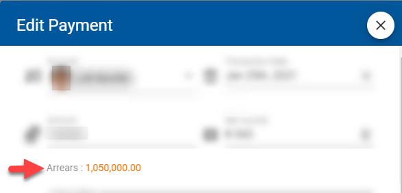
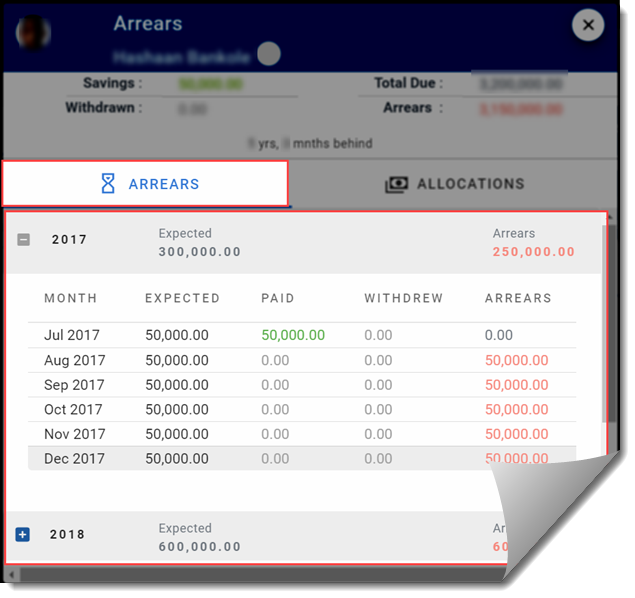
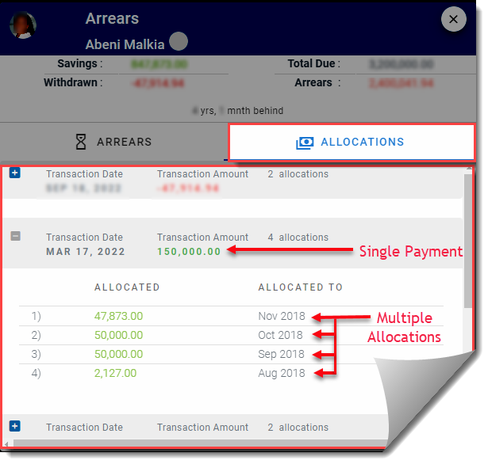

# Arrears Module
 if the [`Track arrears`](admin-modules/app-settings?id=system-will-track-arrears) setting is turned on, the system automatically calculates and tracks how much each club member is supposed to pay every month. The expected amount is compared to the total amount that the member has contributed and if it is less, then the club member is in arrears.

!>**Note.** \
For accurate calculation of arrears, every club member must have their [`Participation Dates`](admin-modules/member-accounts?id=participation-dates) correctly entered by the administrator. Additionally the [`Expected Contributions`](admin-modules/app-settings?id=expected-monthly-contributions) records must be accurately maintained.

## Accessing the arrears module
>**Note.** \
>For the arrears module to be visible, the system must have the [`Track arrears`](admin-modules/app-settings?id=system-will-track-arrears) setting turned on. 

The arrears for a member can be accessed in one of two ways:

1. Click on the arrears link from the [`Savings`](user-modules/savings) page. 

    

2. (Requires `finance_read_all` permissions). From the [`Manage Savings`](admin-modules/manage-savings.md) page do the following:
    - Search for any transaction for the  member that you want to reveiew the arrears. 
    - Click on the transaction to open the [`Edit Payment Dialog`](admin-modules/manage-savings?id=edit-savings-transaction).
    - Under the Transaction amount you will find the arrears link
    

    

## Arrears Module Tabs

### Arrears Tab

The arrears tab provides a breakdown by month, for the member' arrears.  The system keeps track of expected payments based on  [`Participation Dates`](admin-modules/member-accounts?id=participation-dates) of the member and the [`Expected Contributions`](admin-modules/app-settings?id=expected-monthly-contributions) records of the club. When a savings payment is received from the member, it is applied to earliest month that the systems expects payment for the respective member. If the payment is more than (or less than) the expected payment for the month the amount is allocated as described in the allocations section below.

    

All the months for which payment is expected but has not been received is included up as part of the arrears for the particular member.

### Allocations Tab

`Allocations` are useful when a single large payment was made for an account. If the payment is larger than the [`expected contribution`](admin-modules/app-settings?id=expected-monthly-contributions) for the month, then it will be distributed for several months. The single payment is saved as one contribution. Allocations are then used to apportion the single contribution payment to different months.

    

The system automatically handles the allocation of payments distributed accross the months. You can use this tab to track how far ahead or behind the account is with expected payments.