# Loans Module
This module is used to display and manage the details of loans given to the members.

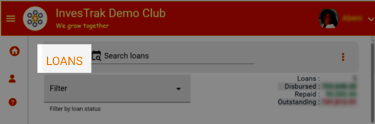

## Accessing the loans module

To access the loans module, click on the navigation menu as follows : `User Menu` ->`My Activity` ->  `Loans`.

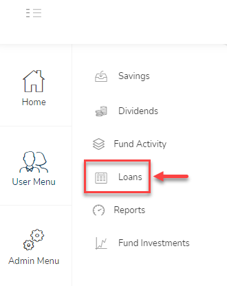

The loans module page displays the list of individual loan applications and a section showing total loans taken by the individual members.

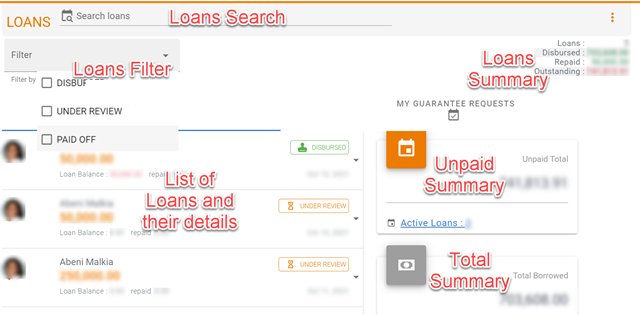

## Searching for a loan record

Use the search bar `Search loans` to find a particular loan record.Type a either a name or a date or amount or part of the memo in the search field to find a specific loan

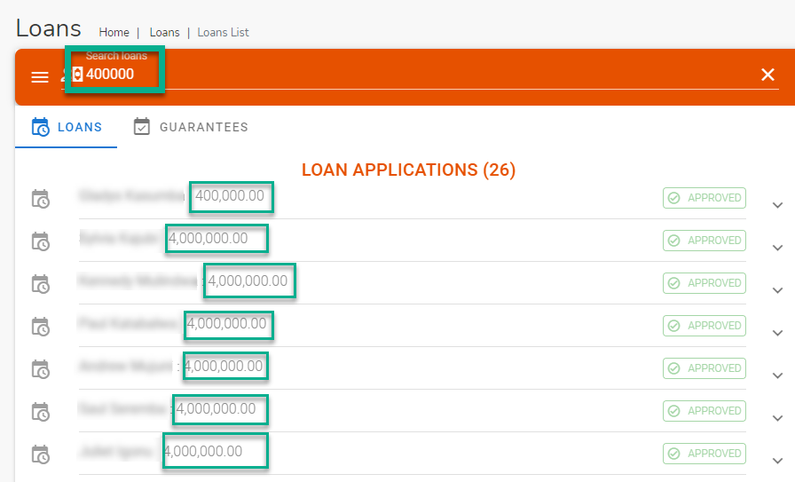

## Apply for a loan
Click on the three horizontal dot menu on the Loans page and select the `Apply for a loan` option

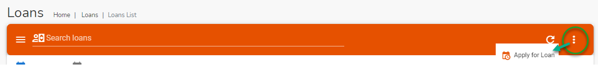

The `Apply Loan` dialog page opens up. Use this dialog to apply for a new loan.

<!-- tabs:start -->

#### **Loan start**
1. You can begin by clicking on your profile to ensure that all your profile details are correct
1. Check the box to accept the loan terms. You can optionally click on the policy link to review all the terms before you accept them
1. Click on the start button to proceed to the next step

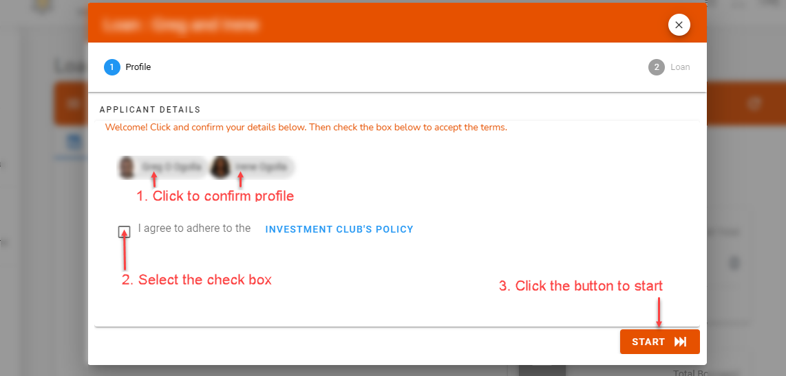

#### **Loan Type**
If your club has different types of loans, select the one that is most suitable for you

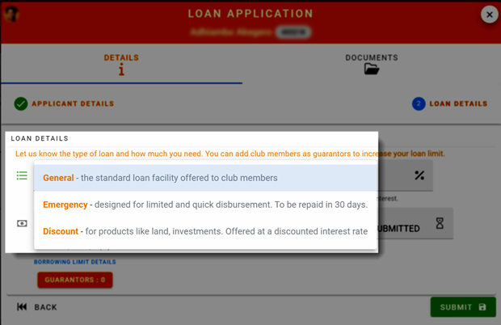

#### **Loan Limit**
Click on the links to confirm what you can borrow

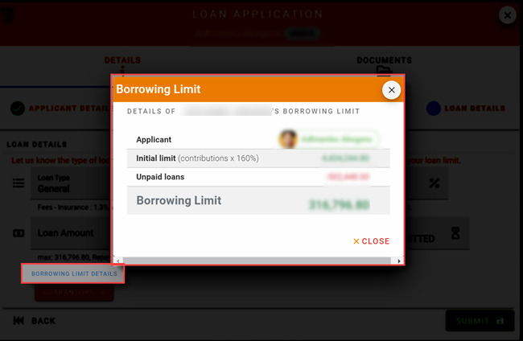

#### **Loan Guarantor**
If you need to borrow more than your loan limit allows, you can add another member as your Guarantor.

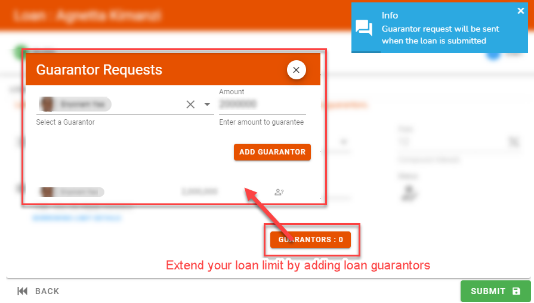

#### **Loan submit**
After confirming the amount and the guarantors click on the submit button. You will receive a notification that your loan has been submitted.

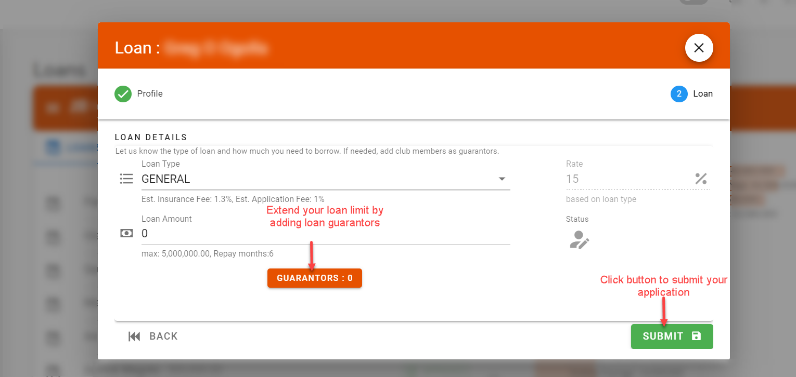

#### **Notification**
You will receive a notification that your loan has been submitted.

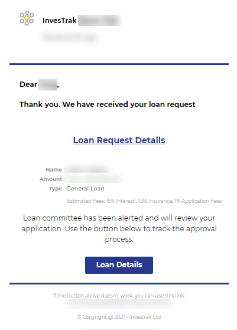

<!-- tabs:end -->

## Loan Guarantee
If you guaranteed any loans they will appear under `Guarantees` tab.

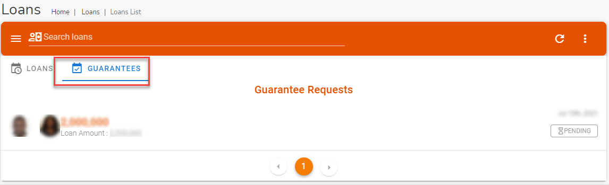

Click on the loan guarantee request to open up the dialog. Use the dialog to reveiw the details of the guarantee request. after confirming the guarantee amount, your loan borrowing limit accept or decline the request.

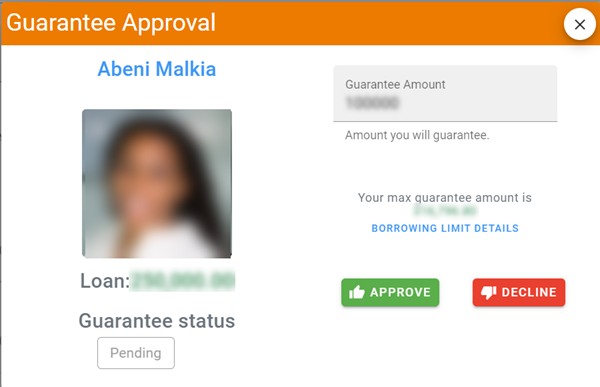

Once you approve or decline a notification will be sent to the loan applicant.

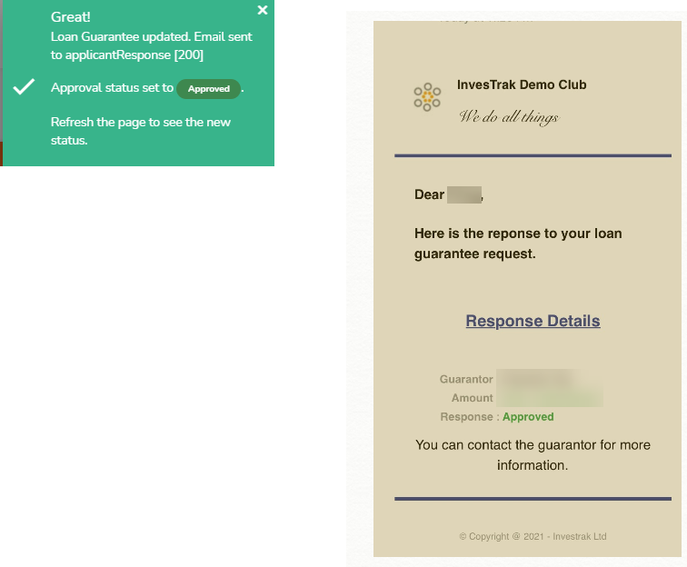

