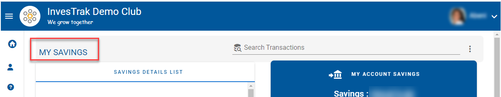
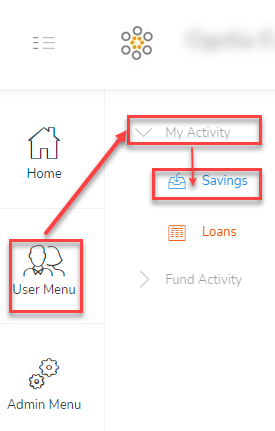
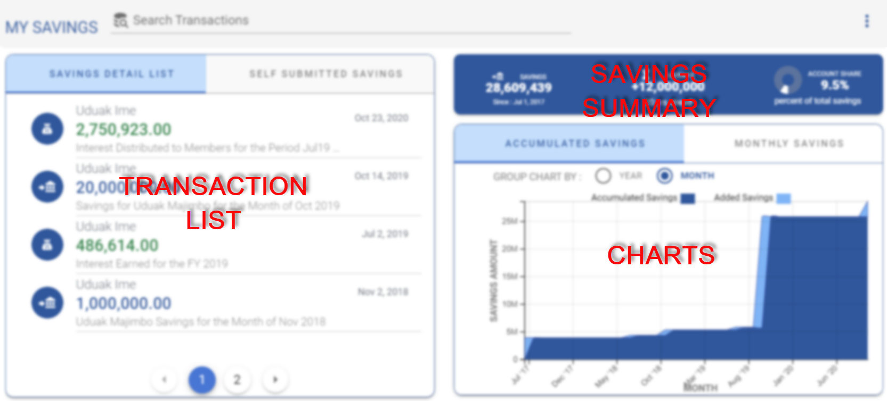
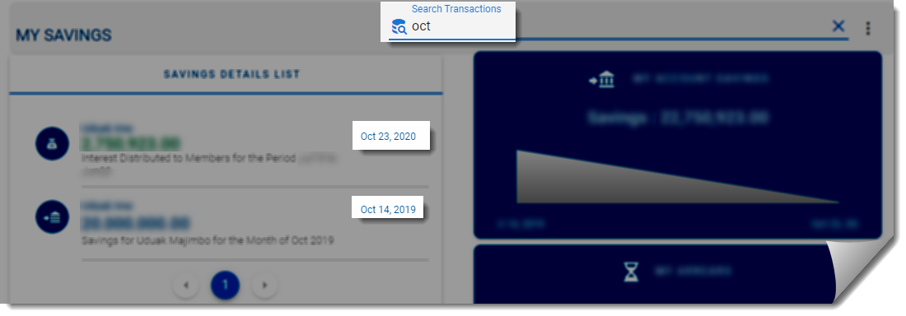
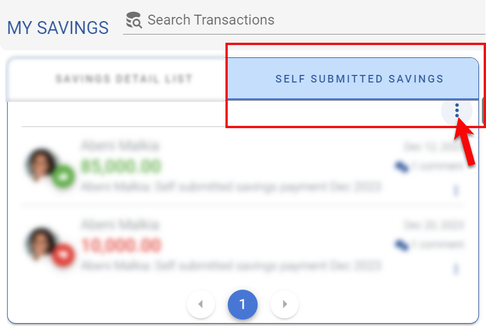
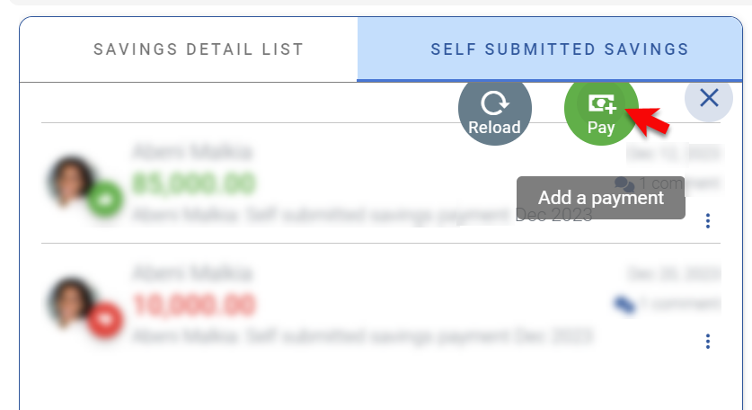
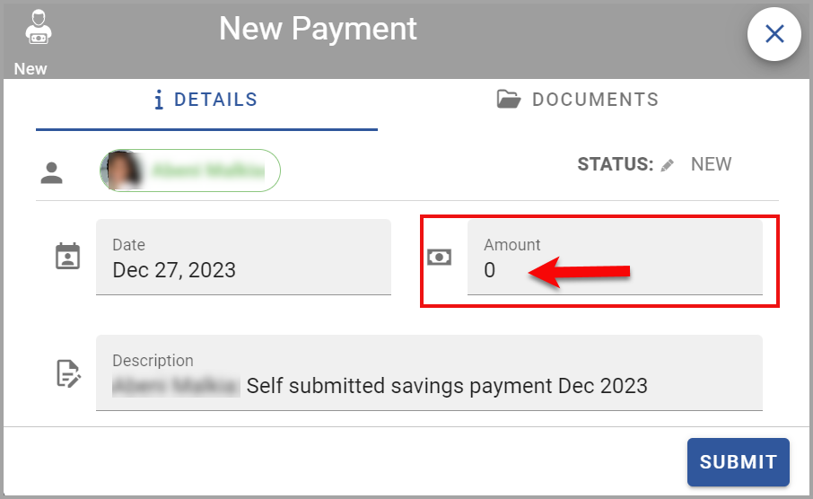
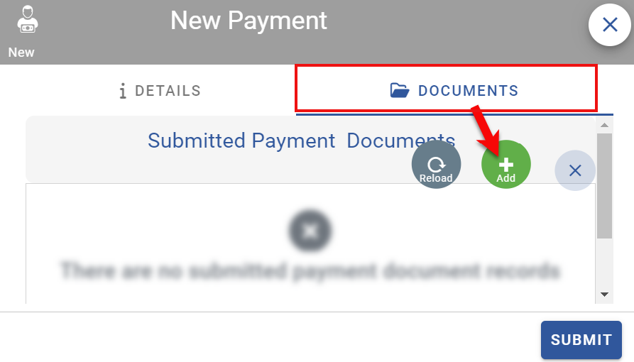
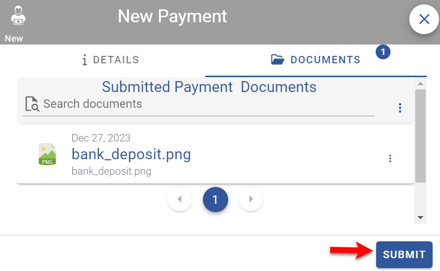
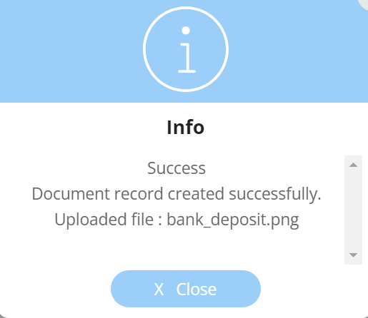

# SAVINGS MODULE
This module is used to display and manage the details of members' savings contributions. 
<!-- 

    

 -->

 

<!-- [filename](../images/video.mp4 ':include :type=video width=400px controls') -->

## Accessing Savings

To access the savings module, click on the navigation menu as follows:

`User Menu` ->`My Activity` -> `Savings`.

<!-- 

    

 -->

The savings module page is roughly divided into 3 sections:

 

1. **TRANSACTIONS LIST** - displays the list of individual transactions (savings desposit, withdrawal and transfers).
2. **SAVINGS SUMMARY** - displays a summary of the savings for the individual account including total savings, arrears, account share (percentage of total contributed savings).
3. **CHARTS** - display charts on the trends of the savings transactions.

## Search Transactions

Use the search bar `Search Transactions` to find a particular transactions. Type a either a name or a date or part of the memo in the search field to find what you are looking for.

 

## Self Submit Savings

If permitted by the Club Administrator or Treasurer, regular club members can record their own savings that they have submitted to the bank. There is a workflow in place so that the Treasurer will be notified and will need to approve before the submitted is added into the account savings.

Follow these steps to make a submission:

1. From the savings page navigate to the `SELF SUBMITTED SAVINGS` tab and click on the 3 vertical dots menu.

&nbsp;&nbsp;&nbsp;&nbsp; 

>**Note.** \
>If you do not see the `SELF SUBMITTED SAVINGS` it means that your club has not been enabled for this feature. Ask your Treasurer or Club Administartor.

2. From the expanded menu options select `Pay` to open the Self submit dialog screen.

&nbsp;&nbsp;&nbsp;&nbsp; 

3. A `New Payment` dialog opens up. Enter the amount that has been self submitted by te member to the bank. Most of the fields are pre-filled and you can edit them if you like.

&nbsp;&nbsp;&nbsp;&nbsp;&nbsp;.

4. Next, click on the `DOCUMENTS` Tab and upload an image of the bank slip or receipt that shows the bank transaction. This is important to allow the Treasurer to review and reconcile the recorded self submitted payment with the bank statements so that it can be approved.
   
&nbsp;&nbsp;&nbsp;.

&nbsp;&nbsp;&nbsp;&nbsp;Details on adding and working with documents can be found on the [`Documents`](user-modules/documents.md) page.

5. Once the receipt image has been uploaded, click on th **`SUBMIT`** button.

&nbsp;&nbsp;&nbsp;&nbsp;&nbsp;.

6. A dialog will be displayed to confirm that the self submitted record has been saved. The treasurer will be notified to reveiw and approve.

&nbsp;&nbsp;&nbsp;&nbsp;&nbsp;.

>**Note.** \
>If more clarification is required after the record has been submitted both the Treasurer and the member can use the `COMMENTS` Tab of the record to provided additional information.

.